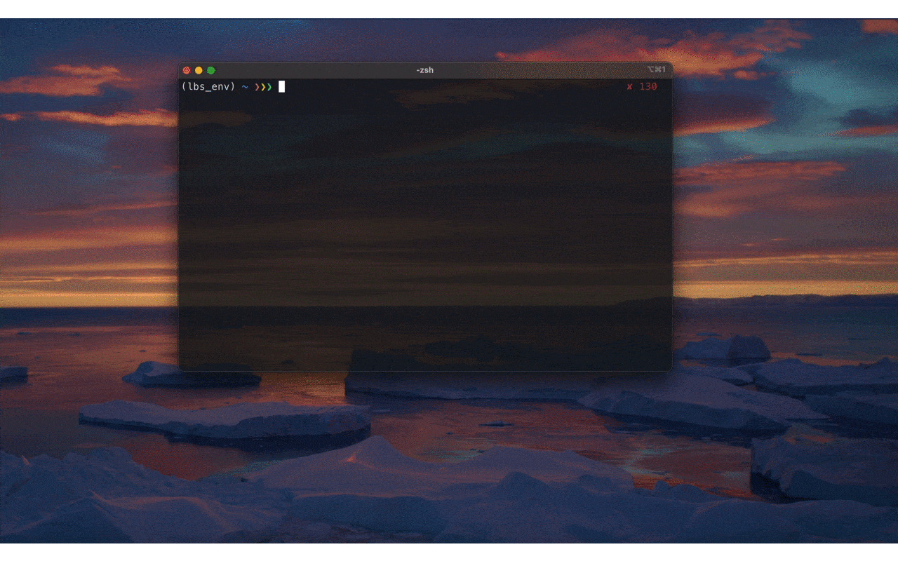

<!--
Template taken from https://github.com/othneildrew/Best-README-Template

*** To avoid retyping too much info. Do a search and replace for the following:
*** github_username, repo, twitter_handle, email
-->


<!-- PROJECT SHIELDS -->
<!--
*** I'm using markdown "reference style" links for readability.
*** Reference links are enclosed in brackets [ ] instead of parentheses ( ).
*** See the bottom of this document for the declaration of the reference variables
*** for contributors-url, forks-url, etc. This is an optional, concise syntax you may use.
*** https://www.markdownguide.org/basic-syntax/#reference-style-links
-->
[](https://litebird-sim.readthedocs.io/en/master/)
[](https://github.com/litebird/litebird_sim/actions?query=workflow%3ATests+branch%3Amaster)
[](https://ci.appveyor.com/project/litebird/litebird-sim)
[![Issues][issues-shield]][issues-url]
[](https://mybinder.org/v2/gh/litebird/litebird_sim/master?filepath=notebooks/litebird_sim_example.ipynb)
[](https://colab.research.google.com/github/litebird/litebird_sim/blob/master/notebooks/litebird_sim_example.ipynb)
[![GPL3 License][license-shield]][license-url]


<!-- PROJECT LOGO -->
<br />
<p align="center">
  <a href="https://github.com/litebird/litebird_sim">
    
  </a>

  <h3 align="center">LiteBIRD Simulation Framework</h3>

  <p align="center">
    Main repository of the LiteBIRD Simulation Framework, a set of Python modules to simulate the instruments onboard the LiteBIRD spacecraft.
    <br />
    <a href="https://litebird-sim.readthedocs.io/en/master/"><strong>Explore the docs »</strong></a>
    <br />
    <br />
    <a href="https://litebird-sim.readthedocs.io/en/master/tutorial.html">View Demo</a>
    ·
    <a href="https://github.com/litebird/litebird_sim/issues">Report Bug</a>
    ·
    <a href="https://github.com/litebird/litebird_sim/issues">Request Feature</a>
  </p>
</p>


<!-- TABLE OF CONTENTS -->
## Table of Contents

* [About the Project](#about-the-project)
  * [Built With](#built-with)
* [Getting Started](#getting-started)
* [Usage](#usage)
* [Roadmap](#roadmap)
* [Contributing](#contributing)
* [License](#license)
* [Contact](#contact)
* [How to cite this code](#how-to-cite-this-code)


<!-- ABOUT THE PROJECT -->
## About The Project

The LiteBIRD Simulation Framework is being developed for the
[LiteBIRD collaboration](http://litebird.jp/eng/).


### Built With

-   Love!
-   [Python 3](https://www.python.org)
-   [Poetry](https://python-poetry.org/)
-   [NumPy](https://numpy.org)
-   [Astropy](https://www.astropy.org)
-   [Healpix](https://healpix.jpl.nasa.gov)
-   [Sphinx](https://www.sphinx-doc.org/en/master/)
-   [Numba](https://numba.pydata.org/)
-   [ducc](https://github.com/litebird/ducc)


## Getting Started

Refer to the
[documentation](https://litebird-sim.readthedocs.io/en/master/installation.html)
to learn how to install the LiteBIRD simulation framework on your
computer or on a HPC cluster.


## Usage

An example notebook is avalable [here](https://github.com/litebird/litebird_sim/blob/master/notebooks/litebird_sim_example.ipynb). 

The documentation is available online at
[litebird-sim.readthedocs.io/en/master/](https://litebird-sim.readthedocs.io/en/master/).

To create a local copy of the documentation, make sure you ran
`poetry` with the flag `--extras=docs`, then run the following
command:

-   Linux or Mac OS X:
    ```
    ./refresh_docs.sh
    ```

-   Windows:
    ```
    poetry shell
    cd docs
    make.bat html
    ```

### Focal plane visualizer 

We can visualize detectors in the focal plane by:
```
python -m litebird_sim.plot_fp
```
This software loads the IMo which is installed in the machine you are using. 

As the conversation unfolds, an interactive Matplotlib window will appear. 
Detectors corresponding to the specified channels are represented as blue dots. 

Clicking on a dot reveals the `DetectorInfo` for that detector in real time, highlighted with a red star. 

Additionally, if you agree during the conversation to generate a detector file,
a list of starred detectors will be saved into a text file at the designated location after you closed the plot.



## Roadmap

See the [open issues](https://github.com/litebird/litebird_sim/issues)
for a list of proposed features (and known issues).


## Contributing

If you are part of the LiteBIRD collaboration and have something that
might fit in this framework, you're encouraged to contact us! Any
contributions you make are **greatly appreciated**.

1.  Read [CONTRIBUTING.md](https://github.com/litebird/litebird_sim/blob/master/CONTRIBUTING.md)
2.  Fork the project
3.  Create your feature branch (`git checkout -b feature/AmazingFeature`)
4.  Commit your changes (`git commit -m 'Add some AmazingFeature'`)
5.  Push to the Branch (`git push origin feature/AmazingFeature`)
6.  Open a Pull Request


## License

Distributed under the [GPL3 License][license-url].


## Contact

LiteBIRD Simulation Team - litebird_pipe@db.ipmu.jp

Project Link: [https://github.com/litebird/litebird_sim](https://github.com/litebird/litebird_sim)


## How to cite this code

TODO!


<!-- MARKDOWN LINKS & IMAGES -->
<!-- https://www.markdownguide.org/basic-syntax/#reference-style-links -->
[issues-shield]: https://img.shields.io/github/issues/litebird/litebird_sim?style=flat-square
[issues-url]: https://github.com/litebird/litebird_sim/issues
[license-shield]: https://img.shields.io/github/license/litebird/litebird_sim.svg?style=flat-square
[license-url]: https://github.com/litebird/litebird_sim/blob/master/LICENSE

<!-- Once we have some nice screenshot, let's put a link to it here! -->
[product-screenshot]: images/screenshot.png
