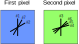
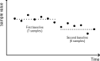
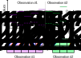

.. _mapmaking:

Map-making
==========

The primary aim of the LiteBIRD Simulation Framework is to create
synthetic timestreams as if they were acquired by the real LiteBIRD
Instrument. The process that creates maps out of these timelines is
called *map-making* and it is strictly considered a data-analysis
task, not a simulation task. However, since most of the assessments on
the quality of a timestream can only be done on maps, the LiteBIRD
Simulation Framework provides some facilities to produce maps out of
timestreams. These maps are created using the `Healpix
<https://en.wikipedia.org/wiki/HEALPix>`_ pixelization scheme and
saved in FITS files.

The framework provides the following solutions:

1. A *binner*, i.e., a simple map-maker that assumes that only
   uncorrelated noise is present in the timelines.

2. A *destriper*, i.e., a more advanced map-maker that can remove the
   effect of correlated instrumental noise from the timelines before
   producing a map. The correlated noise is usually referred as 1/f
   noise, and the purpose of the destriper is to estimate its
   contribution and remove it from the timelines; then, a classical
   *binner* is ran over the cleaned timelines.

3. A wrapper that enables you to use the
   `TOAST2 <https://github.com/hpc4cmb/toast>`_ destriper. (To use
   this, you must ensure that the package
   `toast <https://pypi.org/project/toast/>`_ is installed.)

4. You can also use :func:`.save_simulation_for_madam` to save TODs
   and pointing information to disk and then manually call the `Madam
   mapmaker <https://arxiv.org/abs/astro-ph/0412517>`_.

In this chapter, we assume that you have already created the timelines
that must be provided as input to the destriper. Here is a sample code
that creates a simple timeline containing white noise for two
detectors::

    import numpy as np
    import astropy.units as u
    from numpy.random import MT19937, RandomState, SeedSequence
    
    import litebird_sim as lbs
    
    sim = lbs.Simulation(
        base_path="destriper_output",
        start_time=0,
        duration_s=86400.0,
        random_seed=12345,
    )

    sim.set_scanning_strategy(
        scanning_strategy=lbs.SpinningScanningStrategy(
            spin_sun_angle_rad=np.deg2rad(30),  # CORE-specific parameter
            spin_rate_hz=0.5 / 60,  # Ditto
            # We use astropy to convert the period (4 days) in
            # seconds
            precession_rate_hz=1.0 / (4 * u.day).to("s").value,
        )
    )
    instr = lbs.InstrumentInfo(
        name="core",
        spin_boresight_angle_rad=np.deg2rad(65),
    )
    
    # We create two detectors, whose polarization angles are separated by π/2
    sim.create_observations(
        detectors=[
            lbs.DetectorInfo(name="0A", sampling_rate_hz=10),
            lbs.DetectorInfo(
                name="0B", sampling_rate_hz=10, quat=lbs.quat_rotation_z(np.pi / 2)
            ),
        ],
        dtype_tod=np.float64,  # Needed if you use the TOAST destriper
        n_blocks_time=lbs.MPI_COMM_WORLD.size,
        split_list_over_processes=False,
    )

    # Generate some white noise
    rs = RandomState(MT19937(SeedSequence(123456789)))
    for curobs in sim.observations:
        curobs.tod *= 0.0
        curobs.tod += rs.randn(*curobs.tod.shape)
  

The theory of binners and destripers is explained
in the paper :cite:`2009:kurkisuonio:destriping`,
and the implementation closely follows the terminology
used in the paper. In this chapter, we will refer to
the paper as KS2009.

.. _mapmaking-binner:

Binner
------

Once you have generated a set of observations, either on a single
process or distributed over several mpi processes, you can create a 
simple binned map with the function :func:`.make_binned_map`. This function
takes: a single (or a list of) :class:`.Observation`, the Healpix
resolution of the output map (``nside``) and produces a coadded map.
It assumes white noise and each detector gets weighted by 
:math:`1 / NET^2`. If the pointing information is not provided in the
observation, it can be passed through the optional argument `pointings`, 
with a syntax similar to :func:`.scan_map_in_observations`.
The output map is in Galactic coordinates, but you can specify the
coordinate system you want via the parameter `output_coordinates`.
This is how it should be called::

    result = lbs.make_binned_map(nside=128, observations=observations)
    healpy.mollview(result.binned_map)

(The pointing information is included in the :class:`.Observation`,
alternatively pointings can be provided as a list of numpy arrays.)
The result is an instance of the class :class:`.BinnerResult`
and contains both the I/Q/U maps and the covariance matrix.

The function :func:`.make_binned_map` has a high level interface in the class
:class:`.Simulation` that bins the content of the observations into maps
The syntax is identical to :func:`.make_binned_map`::

    result = sim.make_binned_map(nside=nside)
    healpy.mollview(result.binned_map)

The :class:`.BinnerResult` contains the field ``binned_map``, which
is a Healpix map containing the binned values of the samples.

It is now worth explaining how the binned map is calculated, and we
will do it using a simple example. Suppose that we have measured just
two pixels in the map with only seven measurements. (These numbers are
ridiculous, but in this way the matrices we are going to write will be
more manageable!)

Each sample is associated with a direction in the sky (the *pointing
information*), but from the point of view of the binner the only quantity that
matters is the index of the pixel in the map associated with the pointing
direction. In our example, the seven samples will measure just two pixels in the
sky, with different attack (polarization) angles. The following figure and
table show how the two pixels are observed by the seven TOD samples. The
bars refer to the polarization angle of the detector.

.. _todsamples-in-mapmaking-figure:

   Toy-example of a TOD containing 7 samples.

   The figure shows how the seven samples observe each of the two pixels
   in the map. The thick bars represent the direction of the attack angle
   ψ, which coincides with the polarization angle of the detector projected
   on the center of the pixel.

.. _todsamples-in-mapmaking-table:
.. list-table:: Samples in the TOD, their polarization angle ψ, and the pixel they hit
   :header-rows: 1

   * - #
     - ψ
     - Pixel
   * - 1
     - 90°
     - |pixel1| (1)
   * - 2
     - 30°
     - |pixel1| (1)
   * - 3
     - 90°
     - |pixel2| (2)
   * - 4
     - 15°
     - |pixel2| (2)
   * - 5
     - 30°
     - |pixel2| (2)
   * - 6
     - 45°
     - |pixel2| (2)
   * - 7
     - 60°
     - |pixel1| (1)

A fundamental quantity in KS2009 is the *pointing matrix* matrix
:math:`P`: it is a :math:`(N_t, 3N_p)` matrix where :math:`N_t`
is the number of samples in the TOD (7 in our case) and
:math:`N_p` is the number of pixels observed by the TOD (2 in
our case). Thus, for our simple example :math:`P` is

.. math::

    P = \begin{pmatrix}
    \textcolor{#002683}{1}& \textcolor{#002683}{\cos90^\circ}& \textcolor{#002683}{\sin90^\circ}& 0& 0& 0\\
    \textcolor{#002683}{1}& \textcolor{#002683}{\cos30^\circ}& \textcolor{#002683}{\sin30^\circ}& 0& 0& 0\\
    0& 0& 0& \textcolor{#268300}{1}& \textcolor{#268300}{\cos90^\circ}& \textcolor{#268300}{\sin90^\circ}\\
    0& 0& 0& \textcolor{#268300}{1}& \textcolor{#268300}{\cos15^\circ}& \textcolor{#268300}{\sin15^\circ}\\
    0& 0& 0& \textcolor{#268300}{1}& \textcolor{#268300}{\cos30^\circ}& \textcolor{#268300}{\sin30^\circ}\\
    0& 0& 0& \textcolor{#268300}{1}& \textcolor{#268300}{\cos45^\circ}& \textcolor{#268300}{\sin45^\circ}\\
    \textcolor{#002683}{1}& \textcolor{#002683}{\cos60^\circ}& \textcolor{#002683}{\sin60^\circ}& 0& 0& 0
    \end{pmatrix},

where the number of rows matches the number of samples in the TOD (7), and
for each pixel there are three columns corresponding to I, Q, and U.

It is important that each pixel be covered by enough samples: to recover the
three Stokes parameters associated with it (I, Q, and U), there must
be at least three non-degenerate polarization angles. KS2009
describes how to recover this information through the matrix
:math:`M = P^T\cdot C_w^{-1}\cdot P`, where :math:`C_w` is a diagonal
matrix with shape :math:`(N_t, N_t)`, where each element along the diagonal
is :math:`\sigma^2`, the white-noise variance of the sample:

.. math::

   C_w = \begin{pmatrix}
   \sigma^2& 0& 0& 0& 0& 0& 0\\
   0& \sigma^2& 0& 0& 0& 0& 0\\
   0& 0& \sigma^2& 0& 0& 0& 0\\
   0& 0& 0& \sigma^2& 0& 0& 0\\
   0& 0& 0& 0& \sigma^2& 0& 0\\
   0& 0& 0& 0& 0& \sigma^2& 0\\
   0& 0& 0& 0& 0& 0& \sigma^2
   \end{pmatrix}

The square matrix :math:`M = P^T\cdot C_w^{-1}\cdot P` has shape
:math:`(3 N_p, 3 N_p)`: each pixel in the map is associated to a
3×3 block along the diagonal:

.. math::

    M = \begin{pmatrix}
    \textcolor{#002683}{\frac3{\sigma^2}}&
        \textcolor{#002683}{-\frac1{\sigma^2}}&
        \textcolor{#002683}{\frac{\sqrt3}{\sigma^2}}&
        0& 0& 0\\
    \textcolor{#002683}{-\frac1{\sigma^2}}&
        \textcolor{#002683}{\frac3{2\sigma^2}}&
        \textcolor{#002683}{0}&
        0& 0& 0\\
    \textcolor{#002683}{\frac{\sqrt3}{\sigma^2}}&
        \textcolor{#002683}{0}&
        \textcolor{#002683}{\frac{3}{2\sigma^2}}&
        0& 0& 0\\
    0& 0& 0&
        \textcolor{#268300}{\frac4{\sigma^2}}&
        \textcolor{#268300}{\frac{\sqrt3 - 1}{2\sigma^2}}&
        \textcolor{#268300}{\frac{\sqrt3 + 3}{2\sigma^2}}\\
    0& 0& 0&
        \textcolor{#268300}{\frac{\sqrt3 - 1}{2\sigma^2}}&
        \textcolor{#268300}{\frac2{\sigma^2}}&
        \textcolor{#268300}{\frac{\sqrt3}{2\sigma^2}}\\
    0& 0& 0&
        \textcolor{#268300}{\frac{\sqrt3 + 3}{2\sigma^2}}&
        \textcolor{#268300}{\frac{\sqrt 3}{2\sigma^2}}&
        \textcolor{#268300}{\frac2{\sigma^2}}
    \end{pmatrix}

If we assigned different values for :math:`\sigma` to the
seven elements along the diagonal of :math:`C_w`, then
the 3×3 subblocks of the :math:`M` matrix would have changed
to reflect the fact that those samples with smaller
:math:`\sigma` have a greater weight in determining the
value of the Stokes parameter.

Once we have the matrices :math:`P`, :math:`C_w`, and :math:`M`,
determining the value of the three Stokes parameters I, Q, U for
each pixel is trivial. The signal :math:`s` measured by a detector
is a function of :math:`I`, :math:`Q`, :math:`U`, and the
polarization angle :math:`\psi`:

.. math::

   s = I + Q \cos2\psi + U\sin2\psi

and thus we can exploit the redundancy of the measurements per
each pixel (remember: at least three measurements per pixel with
non-degenerate angles!) by running a simple :math:`\chi^2` minimization
assuming Gaussian noise. The result is the following:

.. math::

   m = M^{-1}\cdot P^T\cdot C_w^{-1}\cdot y,

where :math:`y` is a 7-element vector containing the TOD samples
:math:`s_i` and :math:`m` is a 6-element vector containing the
estimates of the Stokes parameters I, Q, and U for the two pixels
in the map according to the following order:

.. math::

   m = \begin{pmatrix}I_1& Q_1& U_1& I_2& Q_2& U_2\end{pmatrix}

The presence of the matrix :math:`C_w^{-1}` scales
the value of each sample so that the ones affected by larger noise
will be made smaller; the :math:`P^T` factor sums all the samples
in the TOD that fall within the same pixel, and finally :math:`M^{-1}`
“solves” the linear system for the three parameters I, Q, and U per
each pixel.

Once the call to :func:`.make_binned_map` ends, the field ``invnpp``
of the :class:`.BinnerResult` object returned by the function
contains an array with shape :math:`(N_p, 3, 3)`, where each
3×3 block is the inverse of the sub-matrix :math:`M_i` for the
*i*-th pixel.

Data splits
^^^^^^^^^^^

The function :func:`.make_binned_map` is also able to provide data
splits both in time and in detector space. The time split is passed
through a string in the parameter `time_split`; the same applies for
`detector_split`. Currently, the supported time splits are:

- ``"full"`` (default): no split is performed.
- ``"first_half"``: the first half of the TOD is used.
- ``"second_half"``: the second half of the TOD is used.
- ``"odd"``: the odd samples of the TOD are used.
- ``"even"``: the even samples of the TOD are used.
- ``"yearX"``: the TOD samples relative to the X-th year of observation
  is used. The X-th part must be an integer between 1 and 3. 
- ``"surveyX"``: assuming that a complete survey is performed in 6 months,
  the X-th survey is used. The X-th part must be an integer between 1 and 6.

As regards the detector split, the supported options are:

- ``"full"`` (default): no split is performed.
- ``"waferXXX"``: the detectors in the wafer XXX are used. The XXX part
  must specify the desired wafer (e.g. "L00", "M01", or "H02").

The final data split will correspond to the combination of the two splits. 

The function :func:`.check_valid_splits` will check whether the requested
split is part of the list above. If the split is not valid, the function
will raise a ValueError. In addition, it will check whether the requested
split is compatible with the duration of the observation and with the detector
list. Thus, for example, if the observation lasts 1 year, the split "year2"
will raise an AsserionError. Similarly, if the observation is performed with some
detector contained in the L00 wafer, the split "waferL03" will also raise
an AsserionError.

.. _mapmaking-destriper:

Destriper
---------

If you know that your simulation contains 1/f noise, you should avoid
using the binner and use a better map-making algorithm, as the
hypothesis that the noise be white drops and the binning equation is
no longer valid.

The destriping algorithm is implemented by the :func:`.make_destriped_map`,
which is functionally equivalent to :func:`.make_binned_map`. However, as
the algorithm it implements is more complex, you must provide more
information when calling it. Specifically, you should instantiate an
instance of the class :class:`.DestriperParameters`::

    params = DestriperParameters(
        ...
    )

    result = lbs.make_destriped_map(nside=nside, observations=observations, params=params)
    healpy.mollview(result.destriped_map)

The result is an instance of the class :class:`.DestriperResult`, which
is similar to :class:`.BinnerResult` but it contains much more information.

The function :func:`.make_destriped_map` has a high level interface in the class
:class:`.Simulation` that applies the destriper algorithm to all the 
observations in the simulation.
The syntax is identical to :func:`.make_destriped_map`::

    result = sim.make_destriped_map(nside=nside)
    healpy.mollview(result.destriped_map)

We will now explain how a destriper works and what is the meaning of each
parameter in the classes :class:`.DestriperParameters` and
:class:`.DestriperResult`. Apart from KS2009, another source of information
is the file ``test/test_destriper.py``: it compares the results of the
destriper with the analytical solution of the simple 7-sample model we are
discussing here.

The idea of a destriper is to group consecutive samples in the same TOD into
different *baselines*. Each baseline must contain a number of samples such that
the noise within it will be roughly white; thus, the baseline should not contain
too many samples! A good rule of thumb is to make the time span covered by
one baseline shorter than the inverse of the knee frequency for that detector.
The destriper works by assuming that the effect of 1/f noise on all the samples
within the baselines is a purely additive factor; this is an approximation,
but for experiments like Planck has shown to work well.

   Baselines in a destriper

   A destriper seeing the 13 samples in the figure could decide to group them
   into two baselines: 7 within the first baseline, and 6 within the second
   baseline. The level :math:`a_i` of each baseline is represented by a dashed
   horizontal line.

The purpose of the destriper is to model 1/f noise using the baselines and produce
a cleaned map. It does so by doing the following steps:

1.   It estimates the value of the baselines by minimizing a :math:`\chi^2`
     function (more on this later);
2.   It removes the value of the baselines from each sample in the TOD;
3.   It applies a binning operation on the cleaned TOD, using the same equations
     explained in the section :ref:`mapmaking-binner`.

To show a concrete example about how the destriper works, we will resume the
toy TOD containing 7 samples that was discussed in section :ref:`mapmaking-binner`.
We will group these samples in two baselines of 4 and 3 samples respectively.

It's easier to understand what the algorithm does if we play following the rules
of the destriper: instead of thinking of true 1/f noise, let's pretend that what
we actually have in the TOD are the *baselines*: constant values that last for
some time and are added to the samples in the TOD. How can the destriper understand
the level of each baseline in the figure above? The trick is easy to understand
if we recall Table :ref:`todsamples-in-mapmaking-table`. Let's consider the first
pixel: it was visited by the first two samples, then the detector moved to another
position in the sky (the second pixel), but it moved back to the first pixel just
while measuring the last sample in the TOD (#7). The point is that the first two samples
#1 and #2 belong to the first baseline, since it lasts 4 pixels, while sample #7 belongs
to the second one. Yet, once 1/f noise is taken into account, the estimated I/Q/U
parameter for this pixel must agree. This problem can be rewritten as a :math:`\chi^2`
minimization problem: the destriper looks for the values of the two baselines that
minimize the discrepancy in the values of the pixels as estimated by every sample in the TOD.

Apart from the standard matrices :math:`C_w`, :math:`P`, and :math:`M`, the
destriper requires a new matrix :math:`F,` whose shape is :math:`(N_t, N_b)`:

.. math::

   F = \begin{pmatrix}
   1& 0\\
   1& 0\\
   1& 0\\
   1& 0\\
   0& 1\\
   0& 1\\
   0& 1
   \end{pmatrix}

Don't be fooled by the fact that the number of columns is the same as the number
of pixels in the map: in this case, the number of columns corresponds to the
number of *baselines* in the TOD! The operator :math:`F` tells which baseline
“owns” the samples in the TOD, and, as you can see, we are actually assigning
the first four samples to the first baseline and the last three samples to
the last baseline. The application of :math:`F` to a set of :math:`N_t` samples
(the TOD) produces a vector containing :math:`N_b` samples (the baselines). As
it is always the case that :math:`N_b \ll N_t,` this means that :math:`F` is
a very tall and narrow matrix!

The purpose of :math:`F` is to “project” the values of the two baselines
into a 7-element TOD:

.. math::

   F \cdot \begin{pmatrix}a_1\\a_2\end{pmatrix} =
    \begin{pmatrix}
    a_1\\ a_1\\ a_1\\ a_1\\ a_2\\ a_2\\ a_2
    \end{pmatrix}.

The transpose :math:`F^T` represents a linear operator that takes a 7-element
TOD and sums up all the elements belonging to the same baseline:

.. math::

    F^T \cdot \begin{pmatrix}
    y_1\\ y_2\\ y_3\\ y_4\\ y_5\\ y_6\\ y_7
    \end{pmatrix} =
    \begin{pmatrix}y_1 + y_2 + y_3 + y_4\\ y_5 + y_6 + y_7\end{pmatrix}.

At the basis of the destriper there is the operator :math:`Z,` which is defined as
follows:

.. math::

   Z = I - P\cdot M^{-1}\cdot P^T\cdot C_w^{-1}

(:math:`I` is the identity operator), and it is applied to a TOD: :math:`Z\cdot y`.
The purpose of the operator is to “clean up” the TOD from all the components that
are not white noise. It does so by creating a map (note the presence on the right
of the map-binning operator :math:`M^{-1}\cdot P^T\cdot C_w^{-1}` we discussed
before) and then scanning the map back into a TOD (the last operator :math:`P`
on the left of the map-binning operator). Because of the difference between
the identity operator :math:`I` and this matrix, the result of this
“map-and-scan” operation is subtracted from the TOD sample.

The destriper estimates the vector of baselines :math:`a` by solving iteratively
the following equation, which is the solution of a minimization problem on the
:math:`\chi^2` we qualitatively discussed before:

.. math::

   \left(F^T\cdot C_w^{-1}\cdot Z\cdot F\right) a = F^T\cdot C_w^{-1}\cdot Z\cdot y

This equation is of the form :math:`Ax = b,` where :math:`A` and :math:`b` are
known and :math:`x` is the quantity to determine. (The symbol :math:`A` is commonly
found in linear algebra textbooks, so we will switch to this notation even if
KS2009 uses :math:`D`.) The solution would just be :math:`x = A^{-1}b`, but
there are two problems with this formula:

1. Matrix :math:`A` is too large to be inverted;
2. Matrix :math:`A` is not invertible!

The second point is quite alarming, and it might sound like it is an irrecoverable
problem. The fact that :math:`\det A = 0` stems from the fact that the solution to
the destriping equation is not unique, as if :math:`a` is a solution, then
:math:`a + K` is still a solution for any scalar constant :math:`K.` (Remember, the
purpose of the destriper is to make the many measurements for I/Q/U within each
pixel *consistent* once the baselines are subtracted, and the consistency is the same
if all the baselines are shifted by the same amount!) What we are looking for is
a solution :math:`a` that is orthogonal to the null space of :math:`A`.

We can solve both problems by employing the fact that :math:`A` is a symmetric
semi-definite matrix and thus employing the so-called
`Conjugate Gradient (CG) method <https://en.wikipedia.org/wiki/Conjugate_gradient_method>`_,
which is able to produce a solution for the problem :math:`Ax = b` even
if :math:`A` is singular, because it simply minimizes the quantity :math:`Ax - b`
without trying to invert :math:`A`. If you are curious about the details of
the algorithm, a good pedagogical reference is :cite:`1994:shewchuk:conjugategradient`.

The way the algorithm works is to start from a guess for :math:`x` (the set of
baselines) which must be orthogonal to the null-space of :math:`A`; in our
case, it is enough to require that the mean value of the first guess of the baselines
is zero, i.e., :math:`\sum_i x_i = 0`. Starting from guess :math:`x^{(0)},` the
algorithm produces a new guess :math:`x^{(1)}` such that :math:`r^{(1)} = Ax^{(1)} - b` is
closer to zero than :math:`r^{(0)} = Ax^{(0)} - b`. The procedure keeps going until the
residual :math:`r^{(n)} = Ax^{(n)} - b` is small enough, always satisfying the
fact that :math:`\sum_i x_i^{(n)} = 0` for any :math:`n.` Thus, the final solution
will be such that the average value of the baselines will be zero.

The CG algorithm requires iterations to continue until the residuals :math:`r^{(n)}`
are “small enough”. But how can we tell this? Vector :math:`r^{(n)}` contains
:math:`N_b` elements, corresponding to the residual for each baseline, and it might
be that some of the residuals are small and some are not. The most common way to
deal with this is to compute some kind of norm over :math:`r^{(n)}` to produce a
single scalar, and then to check whether this value is below some threshold.
There are several possible definitions for the norm:

1. The standard :math:`L_2` norm (Euclidean): :math:`\left\|r^{(n)}\right\|^2`;
2. The :math:`L_\infty` norm: :math:`\max_i\left|r_i^{(n)}\right|`.

Function :func:`.make_destriped_map` adopts :math:`L_\infty`: it is
stricter than :math:`L_2`, because it does not wash out the
presence of a few large residuals even if all the others are negligible.

The convergence of the Conjugated Gradient can be controlled by the
following fields in the :class:`.DestriperParameters` class:

- ``iter_max``: the maximum number of iterations, i.e., the upper limit for :math:`n`.
- ``threshold``: the value to be reached by the :math:`L_\infty` norm when
  applied to the residuals :math:`r^{(n)}`: if the norm is smaller than ``threshold``,
  then the CG algorithm stops.
- ``samples_per_baseline``: this can either be an integer, in which case it will
  be used for *all* the baselines, or a list of 1D arrays, each containing the
  length of each baseline for each observation passed through the parameter ``observations``.
  Note that if you provide an integer, it might be that not all baselines will
  have exactly that length: it depends whether the number :math:`N_t` of samples
  in the TOD is evenly divisibile by ``samples_per_baseline`` or not. The
  algorithm tries to make the number of elements per baseline as evenly as
  possible.
- ``use_preconditioner``: if this flag is ``True``, the preconditioning matrix
  :math:`F^T\cdot C_w^{-1}\cdot F` will be used with the CG algorithm. This
  might speed up the convergence.

Once the destriper has completed the process, the following fields in the
:class:`.DestriperResult` object can be inspected to check how the CG iterations
went:

- ``converged``: a Boolean flag telling whether the ``threshold`` was reached
  (``True``) or not (``False``)
- ``history_of_stopping_factors``: a list of values of the :math:`L_\infty`
  norm applied to the residuals :math:`r^{(n)},` one per each iteration of
  the CG algorithm. Inspecting those values might help in understanding if
  the destriper was not able to converge because of a too small value of
  ``iter_max``.

The baselines are saved in the field ``baselines`` of the :class:`.DestriperResult`
class; this is a list of 2D arrays, where each element in the list is
associated with one of the observations passed in the parameter ``observations``. The
shape of each 2D arrays is :math:`(N_d, N_b),` where
:math:`N_d` is the number of detectors for the observation and :math:`N_b` is
the number of baselines. A visual representation of the memory layout of
the field ``baselines`` is shown in the following figure.

    Memory layout for baselines.

The image assumes that the baselines contain data for two detectors A and B.
In the **upper image**, the baselines are shown as horizontal lines that span the
time range covered by the two (consecutive) observations. The baselines for
detector A are shown using continuous lines, while the lines for B are dashed.
Note that the number of baselines in the first :class:`.Observation` object
(5) is different than the number in the second object (3).
The **lower image** offers a visual representation of the layout of the
``baselines`` field in the class :class:`.DestriperResult`: it is a Python
list of two elements, each containing 2D arrays with shape :math:`(N_d, N_b)`.
The *i*-th row of each 2D array contains the baselines for the *i*-th detector.

The field ``baseline_errors`` has the same memory layout as ``baselines``
and contains a rough estimate of the error per each baseline, assuming that
the noise in the baselines are not correlated. (Unrealistic!) Finally,
the field ``baseline_lengths`` is a list of 1D integer arrays of :math:`N_b`
elements containing the number of samples in each baseline; it should match
the value provided in the field ``samples_per_baseline`` in the class
:class:`.DestriperParameters`.

Once a solution for the destriping equation has been computed, you can ask
to remove the baselines from the TOD using one of the functions
:func:`.remove_baselines_from_tod` or :func:`.remove_destriper_baselines_from_tod`.

You can save the results of the destriper using the function
:func:`.save_destriper_results` and load them back again with the
:func:`.load_destriper_results`. Note that if you are running your code
using MPI, you should call both functions on *all* the MPI processes,
and the number of processes should be the same between the two calls.

In addition, the function :func:`.make_destriped_map` can accept in input
a custom set of baselines. Provided that these have the correct dimensions,
the destriper will skip the CG iterations and proceed directly to the
map-making step.

How the N_obs matrix is stored
~~~~~~~~~~~~~~~~~~~~~~~~~~~~~~

The destriper uses a different method to store the matrix :math:`M` in
memory. As the 3×3 sub-blocks of this matrix need to be inverted often
during the CG process, the function :func:`.make_destriped_map` decomposes
each block using `Cholesky decomposition
<https://en.wikipedia.org/wiki/Cholesky_decomposition>`_: each 3×3
matrix :math:`M_i` associated with the pixels in the map is decomposed
into

.. math::

   M_i = L_i L_i^T,

where :math:`L` is a lower-triangular matrix, and only the nonzero
coefficients of the matrix are saved. The advantages are twofold:

1. Less memory is required;
2. Calculating the inverse :math:`M^{-1}` is faster and more accurate.

The fields are saved in an instance of the class :class:`.NobsMatrix`,
which contains the following fields:

- ``nobs_matrix`` is a 2D array of shape :math:`(N_p, 6)`, containing
  the nonzero components of the :math:`N_p` matrices;
- ``valid_pixel`` is a 1D Boolean array containing :math:`N_p` elements:
  each of them is ``True`` if the corresponding matrix :math:`M_i`
  was invertible (i.e., it was observed with at least three non-degenerate
  attack angles), ``False`` otherwise;
- ``is_cholesky`` is a flag that tells whether ``nobs_matrix`` contains
  the nonzero coefficients of the many :math:`L_i` matrices or the
  lower triangular part of :math:`M_i`. After a successful call to
  :func:`.make_destriped_map`, this should always be ``True``: it is
  set to ``False`` during the execution of the destriper but updated
  to ``True`` before the CG iteration starts.

Given that it is often useful to have access to matrix :math:`M^{-1}`,
the method :meth:`.NobsMatrix.get_invnpp` computes this inverse as
a 3D array with shape :math:`(N_pix, 3, 3)`, where the first index
runs over all the pixels and the last two dimensions are used to
store the value of :math:`M_i^{-1}`.

Data splits
^^^^^^^^^^^

Similarly to the function :func:`.make_binned_map`, also :func:`.make_destriped_map` is able to provide data splits both in time and in detector space. Given that the splits are implemented identically, refer to the documentation of :func:`.make_binned_map` for more details. 

The only difference we must mention here is that each split is applied to the TOD before the destriper is run. This means that the baselines will be computed using only the samples that fall within the split.

TOAST2 Destriper
----------------

If you install the `toast <https://pypi.org/project/toast/>`_ using ``pip``,
you can use the `TOAST2 <https://github.com/hpc4cmb/toast>`_ destriper within
the LiteBIRD Simulation Framework. As TOAST is an optional dependency, you
should check if the Framework was able to detect its presence::

    import litebird_sim as lbs

    if lbs.TOAST_ENABLED:
        # It's ok to use TOAST
        ...
    else:
        # TOAST is not present, do something else
        ...

The procedure to use the TOAST2 destriper is similar to the steps required to
call the internal destriper: you must create a
:class:`.ExternalDestriperParameters` object that specifies which input
parameters (apart from the timelines) should be used::
  
    params = lbs.ExternalDestriperParameters(
        nside=16,
        return_hit_map=True,
        return_binned_map=True,
        return_destriped_map=True,
    )
  
The parameters we use here are the resolution of the output map
(``nside=16``), and the kind of results that must be returned:
specifically, we are looking here for the *hit map* (i.e., a map that
specifies how many samples were observed while the detector was
looking at a specific pixel), the *binned map* (the same map that
would be produced by the *binner*, see above), and the *destriped map*.

.. note::

   The TOAST destriper only works with timelines containing 64-bit
   floating point numbers. As the default data type for timelines
   created by ``sim.create_observations`` is a 32-bit float, if you
   plan to run the destriper you should pass the flag
   ``dtype_tod=np.float64`` to ``sim.create_observations`` (see the
   code above), otherwise ``destripe`` will create an internal copy of
   the TOD converted in 64-bit floating-point numbers, which is
   usually a waste of space.

To run the TOAST2 destriper, you simply call
:func:`.destripe_with_toast2`::

  result = lbs.destripe_with_toast2(sim, params)

The result is an instance of the class :class:`.Toast2DestriperResult` and
contains the three maps we have asked above (hit map, binned map, 
destriped map).

.. note::

   Unlike the internal destriper, TOAST2 does not return information
   about the convergence of the CG algorithm, and it is *not* granted
   that the norm used to estimate the stopping factor is the same
   as the one calculated by the internal destriper. Therefore, please
   avoid comparing the stopping factors of the two destripers!

Saving files for Madam
----------------------

The function :func:`.save_simulation_for_madam` takes a :class:`.Simulation`
object, a list of detectors and a output path (the default is a subfolder of
the output path of the simulation) and saves a set of files in it:

1. Pointing information, saved as FITS files;
2. TOD samples, saved as FITS files;
3. A so-called «simulation file», named ``madam.sim``;
4. A so-called «parameter file», named ``madam.par``.

These files are ready to be used with the Madam map-maker; you just need
to pass the parameter file ``madam.par`` to one of the executables provided
by Madam (the other ones are referenced by the parameter file). For instance,
the following command will compute the amount of memory needed to run Madam:

.. code-block:: text

    $ inputcheck madam.par

The following command will run Madam:

.. code-block:: text

    $ madam madam.par

Of course, in a realistic situation you want to run ``madam`` using MPI,
so you should call ``mpiexec``, ``mpirun``, or something similar.

Creating several maps with Madam
~~~~~~~~~~~~~~~~~~~~~~~~~~~~~~~~

There are cases where you want to create several maps out of
one simulation. A common case is when you simulate several
components to be put in the TOD and store them in different
fields within each :class:`.Observation` object:

.. code-block:: python

  sim.create_observations(params)

  for cur_obs in sim.observations:
      # We'll include several components in the signal:
      # CMB, white noise, 1/f noise, and dipole
      cur_obs.wn_tod = np.zeros_like(cur_obs.tod)
      cur_obs.oof_tod = np.zeros_like(cur_obs.tod)
      cur_obs.cmb_tod = np.zeros_like(cur_obs.tod)
      cur_obs.dip_tod = np.zeros_like(cur_obs.tod)

      # Now fill each of the *_tod fields appropriately

In cases like this, it is often useful to generate several
sets of maps that include different subsets of the components:

1.  A map including just the CMB and white noise;
2.  A map including CMB, white noise and 1/f, but not the dipole;
3.  A map including all the components.

You could of course call :func:`.save_simulation_for_madam` three
times, but this would be a waste of space because you would end
up with three identical copies of the FITS file containing the
pointings, and the last set of FITS files would contain the same
components that were saved for the first two maps.
(Remember, :func:`.save_simulation_for_madam` saves both the
pointings and the TODs!)

A trick to avoid wasting so much space is to save the FITS files
only once, including *all* the TOD components, and then call
:func:`.save_simulation_for_madam` again for each other map using
``save_pointings=False`` and ``save_tods=False``:

.. code-block:: python

  # This code will generate *three* sets of Madam files:
  # - One including the CMB and white noise
  # - One including 1/f as well
  # - The last one will include the dipole too
  save_files = True

  # Iterate over all the maps we want to produce. For each of
  # them we specify the name of the subfolder where the Madam
  # files will be saved and the list of components to include
  for (subfolder, components_to_bin) in [
      ("cmb+wn", ["wn_tod", "cmb_tod"]),
      ("cmb+wn+1f", ["wn_tod", "oof_tod", "cmb_tod"]),
      ("cmb+wn+1f+dip", ["wn_tod", "oof_tod", "cmb_tod", "dip_tod"]),
  ]:
      save_simulation_for_madam(
          sim=sim,
          params=params,
          madam_subfolder_name=subfolder,
          components=["cmb_tod", "wn_tod", "oof_tod", "dipole_tod"],
          components_to_bin=components_to_bin,
          save_pointings=save_files,
          save_tods=save_files,
       )

       # Set this to False for all the following iterations (maps)
       save_files = False

It is important that the `components` parameter in the call to
:func:`.save_simulation_for_madam` list *all* the components, even
if they are not going to be used in the first and second map. The reason
is that this parameter is used by the function to create a «map» of the
components as they are supposed to be found in the FITS files; for
example, the ``cmb_tod`` field is the *third* in each TOD file, but this
would not be apparent while producing the first map, where it is the
*second* in the list of components that must be used. The ``.par``
file will list the components that need to be actually used to
create the map, so it will not be confused if the TOD FITS files
will contain more components than needed. (This is a neat feature
of Madam.)

.. note::

   To understand how this kind of stuff works, it is useful to
   recap how Madam works, as the possibility to reuse TODs for
   different maps is linked to the fact that Madam requires
   *two* files to be run: the *parameter file* and the *simulation
   file*.

   The *simulation file* represents a «map» of the content of a
   set of FITS files. No information about the map-making process
   is included in a simulation file: it just tells how many FITS
   files should be read and what is inside each of them.

   The *parameter file* is used to tell Madam how you want maps
   to be created. It's in the parameter file that you can ask
   Madam to skip parts of the TODs, for example because you do
   not want to include the dipole in the output map.

   When you call :func:`.save_simulation_for_madam`, the
   `components` parameter is used to build the *simulation file*:
   thus, if you plan to build more than one map out of the same
   set of components, you want to have the very same simulation
   files, because they «describe» what's in the FITS files. This
   is the reason why we passed the same value to `components`
   every time we called :func:`.save_simulation_for_madam`.

   But when we create the three *parameter files*, each of them
   differs in the list of components that need to be included.
   If you inspect the three files ``cmb+wn/madam.par``,
   ``cmb+wn+1f/madam.par``, and ``cmb+wn+1f+dip/madam.par``, you
   will see that they only differ for the following lines::

      # cmb+wn/madam.par
      tod_1 = wn_tod
      tod_2 = cmb_tod

      # cmb+wn+1f/madam.par
      tod_1 = wn_tod
      tod_2 = oof_tod
      tod_3 = cmb_tod

      # cmb+wn+1f+dip/madam.par
      tod_1 = wn_tod
      tod_2 = oof_tod
      tod_3 = cmb_tod
      tod_4 = dip_tod

   That's it. The lines with ``tod_*`` are enough to
   do all the magic to build the three maps.

Of course, once the three directories ``cmb+wn``, ``cmb+wn+1f``, and
``cmb+wn+1f+dip`` are created, Madam will run successfully only in
the first one, ``cmb+wn``. The reason is that only that directory
includes the pointing and TOD FITS files! But if you are saving data
on a filesystem that supports `symbolic links
<https://en.wikipedia.org/wiki/Symbolic_link>`_, you can use them to
make the files appear in the other directories too. For instance, the
following commands will create them directly from a Unix shell (Bash,
Sh, Zsh):

.. code-block:: sh

  ln -srv cmb+wn/*.fits cmb+wn+1f
  ln -srv cmb+wn/*.fits cmb+wn+1f+dip

(The ``-s`` flag asks to create *soft* links, the ``-r`` flag requires
paths to be relative, and ``-v`` makes ``ln`` be more verbose.)

If you want a fully authomatic procedure, you can create the symbolic
links in Python, taking advantage of the fact that
:func:`.save_simulation_for_madam` returns a dictionary containing the
information needed to do this programmatically:

.. code-block:: python

   # First map
   params1 = save_simulation_for_madam(sim, params)

   # Second map
   params2 = save_simulation_for_madam(
       sim,
       params,
       madam_subfolder_name="madam2",
       save_pointings=False,
       save_tods=False,
   )

   # Caution: you want to do this only within the first MPI process!
   if litebird_sim.MPI_COMM_WORLD.rank == 0:
       for source_file, dest_file in zip(
           params1["tod_files"] + params1["pointing_files"],
           params2["tod_files"] + params2["pointing_files"],
       ):
           # This is a Path object associated with the symlink that we
           # want to create
           source_file_path = source_file["file_name"]
           dest_file_path = dest_file["file_name"]

           dest_file_path.symlink_to(source_file_path)

You can include this snippet of code in the script that calls
:func:`.save_simulation_for_madam`, so that the procedure will
be 100% automated.

API reference
-------------

.. automodule:: litebird_sim.mapmaking
    :members:
    :undoc-members:
    :show-inheritance:

.. automodule:: litebird_sim.madam
    :members:
    :undoc-members:
    :show-inheritance:
