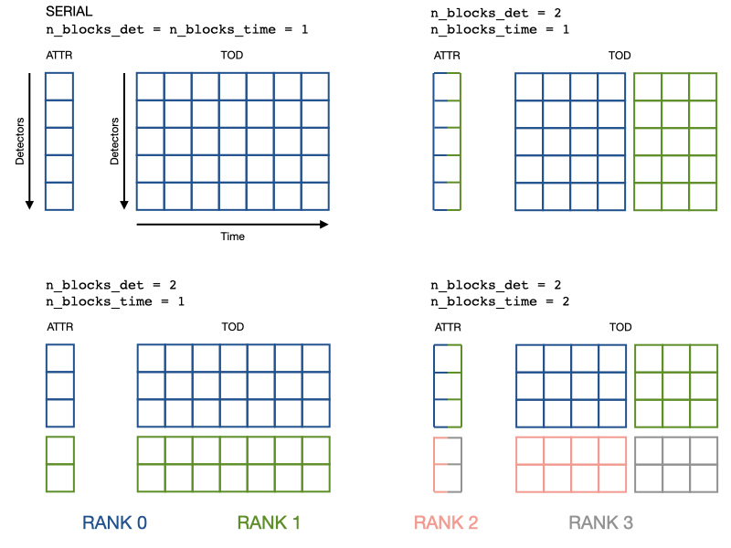

Observations
============

The :class:`.Observation` class, is the container for the data acquired by the
telescope during a scaning period (and the relevant information about it).

Serial applications 
-------------------

In a serial code :class:`.Observation` is equivalent to an empty class in which you
can put anything::

  import litebird_sim as lbs
  import numpy as np

  obs = lbs.Observation(
      detectors=2,
      start_time_global=0.0,
      sampling_rate_hz=5.0,
      n_samples_global=5,
  )

  obs.my_new_attr = 'value'
  setattr(obs, 'another_new_attr', 'another value')

Across the framework, the coherence in the names and content of the
attributes is guaranteed **by convention** (no check is done by the
:class:`.Observation` class). At the moment, the most common field
that you can find in the class are the following, assuming that it is
meant to collect $N$ samples for $n_d$ detectors:

1. ``Observation.tod`` is initialized when you call
   :meth:`.Simulation.create_observations`. It's a 2D array
   of shape :math:`(n_d, N)`. This means that ``Observation.tod[0]`` is
   the time stream of the first detector, and ``obs.tod[:, 0]`` are the
   first time samples of all the detectors.

2. ``Observation.pointings`` is initialized when you call
   :meth:`.Simulation.compute_pointings`. It is a 3-rank
   tensor of shape :math:`(n_d, N, 2)`, where the last rank collects the
   two pointing angles colatitude (θ) and longitude (φ), expressed in
   radians.

3. ``Observation.pointing_coords`` is initialized together with
   ``Observation.pointings``; it is a value of type
   :class:`.CoordinateSystem`, and it identifies the coordinate system
   used to express the pointing angles.

4. ``Observation.psi`` is a :math:`(n_d, N)` matrix containing the
   polarization angles (in radians), expressed with respect to the
   celestial North (ψ). It's initialized together with
   ``Observation.pointings``.

5. ``Observation.local_flags`` is a :math:`(n_d, N)` matrix containing
   flags for the :math:`n_d` detectors. These flags are typically
   associated to peculiarities in the single detectors, like
   saturations or mis-calibrations.

6. ``Observation.global_flags`` is a vector of :math:`N` elements
   containing flags that must be associated with *all* the detectors
   in the observation.

Keep in mind that the general rule is that detector-specific
attributes are collected in arrays. Thus, ``obs.calibration_factors``
should be a 1-D array of :math:`n_d` elements (one per each detector).

With this memory layout, typical operations look like this::

  # Collect detector properties in arrays
  obs.calibration_factors = np.array([1.1, 1.2])
  obs.wn_levels = np.array([2.1, 2.2])

  # Apply to each detector its own calibration factor
  obs.tod *=  obs.calibration_factors[:, None]

  # Add white noise at a different level for each detector
  obs.tod += (np.random.normal(size=obs.tod.shape)
              * obs.wn_levels[:, None])

                
Parallel applications
---------------------

The only work that the :class:`.Observation` class actually does is handling
parallelism. ``obs.tod`` can be distributed over a 
``n_blocks_det`` by ``n_blocks_time`` grid of MPI ranks. The blocks can be
changed at run-time.

The coherence between the serial and parallel operations is achieved by
distributing also the arrays of detector properties:
each rank keeps in memory only an interval of ``calibration_factors`` or
``wn_levels``, the same detector interval of ``tod``.

The main advantage is that the example operations in the Serial section are
achieved with the same lines of code.
The price to pay is that you have to set detector properties with special methods.

::

  import litebird_sim as lbs
  from mpi4py import MPI

  comm = MPI.COMM_WORLD

  obs = lbs.Observation(
      detectors=2,
      start_time_global=0.0,
      sampling_rate_hz=5.0,
      n_samples_global=5,
      n_blocks_det=2, # Split the detector axis in 2
      comm=comm  # across the processes of this communicator
  )

  # Add detector properties either with a global array that contains 
  # all the detectors (which will be scattered across the processor grid)
  obs.setattr_det_global('calibration_factors', np.array([1.1, 1.2]))
  
  # Or with the local array, if somehow you have it already
  if comm.rank == 0:
      wn_level_local = np.array([2.1])
  elif comm.rank == 1:
      wn_level_local = np.array([2.2])
  else:
      wn_level_local = np.array([])
  obs.setattr_det('wn_levels', wn_level_local)
  
  # Operate on the local portion of the data just like in serial code

  # Apply to each detector its own calibration factor
  obs.tod *=  obs.calibration_factors[:, None]

  # Add white noise at a different level for each detector
  obs.tod += (np.random.normal(size=obs.tod.shape)
              * obs.wn_levels[:, None])

  # Change the data distribution
  obs.set_blocks(n_blocks_det=1, n_blocks_time=1)
  # Now the rank 0 has exactly the data of the serial obs object

For clarity, here is a visualization of how data (a detector attribute and the
TOD) gets distributed.

When ``n_blocks_det != 1``,  keep in mind that ``obs.tod[0]`` or
``obs.wn_levels[0]`` are quantities of the first *local* detector, not global.
This should not be a problem as the only thing that matters is that the two
quantities refer to the same detector. If you need the global detector index,
you can get it with ``obs.det_idx[0]``, which is created
at construction time.

To get a better understanding of how observations are being used in a
MPI simulation, use the method :meth:`.Simulation.describe_mpi_distribution`.
This method must be called *after* the observations have been allocated using
:meth:`.Simulation.create_observations`; it will return an instance of the
class :class:`.MpiDistributionDescr`, which can be inspected to determine
which detectors and time spans are covered by each observation in all the
MPI processes that are being used. For more information, refer to the Section
:ref:`simulations`.

Other notable functionalities
-----------------------------

The starting time can be represented either as floating-point values
(appropriate in 99% of the cases) or MJD; in the latter case, it
is handled through the `AstroPy <https://www.astropy.org/>`_ library.

Instead of adding detector attributes after construction, you can pass a list of
dictionaries (one entry for each detectors). One attribute is created for every
key.

::

  import litebird_sim as lbs
  from astropy.time import Time
  
  # Second case: use MJD to track the time
  obs_mjd = lbs.Observation(
      detectors=[{"name": "A"}, {"name": "B"}]
      start_time_global=Time("2020-02-20", format="iso"),
      sampling_rate_hz=5.0,
      nsamples_global=5,
  )

  obs.name == np.array(["A", "B"])  # True

Reading/writing observations to disk
------------------------------------

The framework implements a couple of functions to write/read
:class:`.Observation` objects to disk, using the HDF5 file format. By
default, each observation is saved in a separate HDF5 file; the
following information are saved and restored:

- Whether times are tracked as floating-point numbers or proper
  AstroPy dates;
- The TOD matrix (in ``.tod``);
- Any pointing information stored in ``.pointings`` (the matrix
  containing the colatitude and longitude of the direction of the main
  beam axis), ``.psi`` (the polarization angle), and ``.pixidx`` (the
  index of the pixel in the Healpix pixelization scheme).
- Global and local flags saved in ``.global_flags`` and
  ``.local_flags`` (see below).

The function used to save observations is :func:`.write_observations`,
which works with a :class:`.Simulation` object; if you prefer to
operate without a :class:`.Simulation` object, you can call
:func:`.write_list_of_observations`.

To read observations, you can use :func:`.read_observations` and
:func:`.read_list_of_observations`.

  
Flags
-----

The LiteBIRD Simulation Framework permits to associate flags with the
scientific samples in a TOD. These flags are usually unsigned integer
numbers that are treated like bitmasks that signal peculiarities in
the data. They are especially useful when dealing with data that have
been acquired by some real instrument to signal if the hardware was
malfunctioning or if some disturbance was recorded by the detectors.
Other possible applications are possible:

1. Marking samples that should be left out of map-making (e.g.,
   because a planet or some other transient source was being observed
   by the detector).

2. Flagging potentially interesting observations that should be used
   in data analysis (e.g., observations of the Crab nebula that are
   considered good enough for polarization angle calibration).

Similarly to other frameworks like TOAST, the LiteBIRD Simulation
Framework lets to store both «global» and «local» flags associated
with the scientific samples in TODs. Global flags are associated with
all the samples in an Observation, and they must be a vector of ``M``
elements, where ``M`` is the number of samples in the TOD. Local
samples are stored in a matrix of shape ``N × M``, where ``N`` is the
number of detectors in the observation.

The framework encourages to store these flags in the fields
``local_flags`` and ``global_flags``: in this way, they can be saved
correctly in HDF5 files by functions like :func:`.write_observations`.

API reference
-------------

.. automodule:: litebird_sim.observations
    :members:
    :undoc-members:
    :show-inheritance:

.. automodule:: litebird_sim.io
    :members:
    :undoc-members:
    :show-inheritance:
