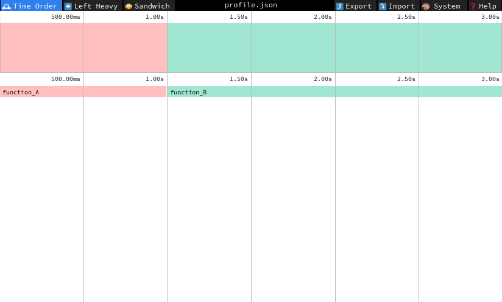

.. _profiling:

Profiling
=========

The LiteBIRD Simulation Framework implements a few tools to measure the performance of the code.

Basic profiling
---------------

The class :class:`.TimeProfiler` is a context manager that measures the amount of time spent running the code within a ``with`` block.

Here is an example:

.. testcode::

   from litebird_sim import TimeProfiler
   from time import sleep

   with TimeProfiler(name="my_code") as perf:
       sleep(1.0)

   print(f"The elapsed time is {perf.elapsed_time_s():.0f} s")

.. testoutput::

   The elapsed time is 1 s

Custom parameters
-----------------

The constructor for :class:`.TimeProfiler` accepts keyword arguments; they are saved in the `parameters` field of the object:

.. testcode::

   from litebird_sim import TimeProfiler
   from time import sleep

   with TimeProfiler(name="my_code", my_param="hello") as perf:
       sleep(0.1)

   print("my_param =", perf.parameters["my_param"])

.. testoutput::

   my_param = hello

Export to Speedscope
--------------------

You can collect several :class:`TimeProfiler` objects in a list and save it in a JSON file that can be imported into `Speedscope <https://www.speedscope.app/>`_, an online viewer for performance profiles.
This can be done using the function :func:`.profile_list_to_speedscope`, which outputs a dictionary that can be saved to a JSON file.

Here is an example::

    import json
    from litebird_sim import TimeProfiler, profile_list_to_speedscope
    from time import sleep

    perf_list = []  # type: list[TimeProfiler]

    # First code block to profile
    with TimeProfiler(name="function_A") as perf:
        sleep(1.0)
    perf_list.append(perf)

    # Second code block to profile
    with TimeProfiler(name="function_B") as perf:
        sleep(2.0)
    perf_list.append(perf)

    # Save the profile measurements into "profile.json"
    with open("profile.json", "wt") as out_f:
        json.dump(profile_list_to_speedscope(perf_list), out_f)

    # Now go to https://www.speedscope.app/ and open "profile.json"

When the file ``profile.json`` is opened in https://www.speedscope.app/, you will see a time graph with two horizontal bars representing the two ``with`` blocks:

When using the :class:`.Simulation` class, a number of functions are automatically profiled and JSON files are saved automatically in the output directory.
See Sect. :ref:`simulation-profiling` for more information.

API reference
-------------

.. automodule:: litebird_sim.profiler
    :members:
    :undoc-members:
    :show-inheritance:
