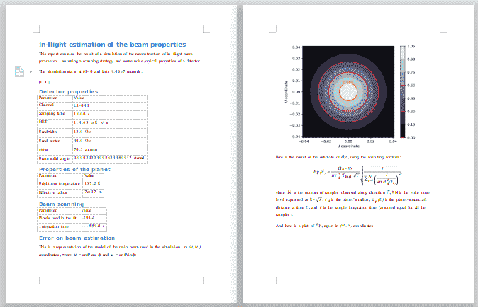
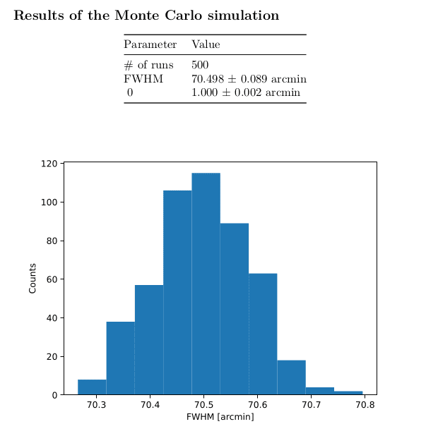

.. _reporting:

Creating reports
================

The LiteBIRD simulation framework has the ability to automatically
produce reports in the output directory specified during the creation
of a :class:`.Simulation` object.

The framework uses the `Jinja2
<https://jinja.palletsprojects.com/en/2.11.x/>`_ templating library to
render the text, and the `Python-Markdown
<https://python-markdown.github.io/>`_ library to convert the text to
HTML.

The usage of the facility is easy::

  import litebird_sim as lbs
  import matplotlib.pylab as plt

  # Create some plot
  data_points = [0, 1, 2, 3]
  plt.plot(data_points)
  fig = plt.gcf()

  sim = lbs.Simulation(base_dir="./report_example", random_seed=12345)
  sim.append_to_text("""

  ## Section name

  Here is some Markdown text written in *italic* and in **bold**.

  Here is a list:

  - One
  - Two
  - Three

  The value of the variable `foo` is {{ foo }}.

  And here is a figure:

  
  """,
      figures=[(fig, "myfigure.png")],
      foo=123,
  )

The method :meth:`.Simulation.append_to_report` accepts arbitrary
keywords, which are substituted in the string whenever the form ``{{ …
}}`` is found. Thus, the string ``The value of the variable `foo` is
{{ foo }}`` is converted into ``The value of the variable `foo` is
123``. The keyword ``figures`` is however interpreted directly by
:meth:`.Simulation.append_to_report`: it must be a list of 2-tuples of
the form ``(figure, filename)``, and it triggers the save of the
Matplotlib figure into a file with the specified name; you can refer
to the file using Markdown's usual syntax ````, as shown
in the example above.


Including tables
----------------

Reports can include tables as well. They are formatted using the ASCII
characters ``|`` and ``-``, as in the following example::

  sim.append_to_report("""

  Here is a table:

  Column A   | Column B
  ---------- | ------------
  Item 1 | Value 1
  Item 2 | Value 2
  Item 3 | Value 3
  """)

If you are going to write the rows of the table using Jinja2's ``for``
loops, be sure to end the loop with ```` instead of ````, in order not to leave empty lines between consecutive rows.


Converting the report to other formats
--------------------------------------

It might be the case that the report produced by your script contains
some complex table/paragraphs that you would like to include in an
article written in LaTeX or Microsoft Word. You can easily convert the
report into one of these formats using `Pandoc <https://pandoc.org/>`_.

The Simulation Framework saves the Markdown source text of the report
in the same directory as ``report.html``, and you can ask Markdown to
convert to some other format than HTML. The following shell commands
will produce files ``report.tex`` (LaTeX source), ``report.docx``
(Microsoft Word file), and ``report.pdf`` (PDF file produced using
LaTeX):

.. code-block:: text

   $ pandoc -f markdown -t latex -o report.tex report.md
   $ pandoc -f markdown -t docx -o report.docx report.md
   $ pandoc -f markdown -t latex -o report.pdf report.md

Any image included in the report is saved in the same directory as
``report.md`` and ``report.html``, so you can take and reuse them. To
ease the possibility to include images in the documents, you should
stick to the PNG image format, as it is easily embeddable in HTML,
pdfLaTeX/xeLaTeX/luaLaTeX, and Microsoft Word files. The alternative
is to manually convert the image files to other formats.

If the report contains mathematical equations, things get a little
trickier. You must create a text file with your favourite editor and
copy the following code in it (the file is available in the Python
distribution as ``litebird_sim/misc/pandoc-filter.lua``):

.. code-block:: lua

   -- mode: lua

   -- Pass the following option to pandoc:
   --
   --   pandoc --lua-filter gitlab-math.lua ...
   --
   -- to use this filter

   function Math(el)
      if el.mathtype == "InlineMath" then
         if el.text:sub(1,1) == '`' and el.text:sub(#el.text) == '`' then
            local text = el.text:sub(2,#el.text-1)
            return pandoc.Math(el.mathtype, text)
         else
            local cont = pandoc.read(el.text)
            return { pandoc.Str("$") } .. cont.blocks[1].content .. { pandoc.Str("$") }
         end
      end
   end

   function CodeBlock(el)
      if el.classes[1] == "math" then
         return pandoc.Para({ pandoc.Math("DisplayMath", el.text) })
      end
   end


and save it somewhere in your computer; let's suppose that the path is
``/my/scripts/litebird-sim-pandoc.lua`` (better to use the extension
``.lua``, as this is a `Lua <https://www.lua.org/>`_ script). Then,
run pandoc with the option ``--lua-filter
/my/scripts/litebird-sim-pandoc.lua`` and the equations will be
converted properly. The following image shows the result of running
the filter on a report generated by an analysis script to convert the
report in a ``docx`` file:



And here is a screenshot of one page of the PDF file that has been
produced by Pandoc by converting the same document to a LaTeX file:
           


Converting reports to LaTeX is particularly handy when you want to
re-use tables written in the report, as these are notoriously a pain
to write manually in LaTeX.


A few stylistical tips
----------------------

Template files
~~~~~~~~~~~~~~

If the report is getting larger and larger, it is advisable to move
the string passed to :meth:`.Simulation.append_to_report` in a
separate file and load it at runtime. (This is what we do in the
source code of the framework, see the folder
``litebird_sim/templates``.) For instance,
you could put the following text in a file ``my_template_report.md``:

.. code-block:: text

  Here is some number: {{ "0.2f" | format(val) }}
  Blah blah blah

  Here follows a few very long paragraphs...

  And here some more text...

and then you would load it in your script in the following way::

  with open("my_template_report.md", "rt") as inpf:
      template = "".join(inpf.readlines())

  sim.append_to_report(template, val=value)

In this way, you can remove much clutter from the Python file, and it
is easier for people who want to improve the report to contribute, as
they do not need to understand Python to do it.

  
Where to put the formatting logic
~~~~~~~~~~~~~~~~~~~~~~~~~~~~~~~~~
  
You should always try to put the formatting logic of the report within
the string passed to :meth:`.Simulation.append_to_report`, possibly
using `Jinja2's filters
<https://jinja.palletsprojects.com/en/2.11.x/templates/#filters>`_,
instead of formatting the arguments in your Python script. Thus,
instead of doing this::

  sim.append_to_report(
      "Here is some number: {{ val }}",
      val="%0.2f" % value,    # Don't do this!
  )

you should do this::

  # Ok, put the formatting logic into the string and rely
  # on Jinja2's filter named "format"
  sim.append_to_report(
      'Here is some number: {{ "0.2f" | format(val) }}',
      val=value,
  )

The reason is that if you keep the template in a separate Markdown
file, as explained above, it is better to put whatever concerns the
*representation* of the values in the template instead of the code.
For instance, at some point you might revise the layout of your report
by adding space, and this might enable you to write some date field as
``February, 8th 2022`` instead of ``22-02-08``; this kind of change
should affect only the Markdown template and not the Python code,
because it's the template that was modified to enable more space.

Try to follow this tip even for short snippets: in the authors'
experience, it is often the case that short reports grow more and more
as time passes, until at some point they are moved to separate
Markdown files!
  
You can refer to `Jinja2's documentation
<https://jinja.palletsprojects.com/en/2.11.x/templates/#filters>`_ for
a complete list of filters, but here is a selection of the most useful
ones:

- ``{{ str | format(value) }}`` formats ``value`` like the C function
  ``printf(str, value)``

- ``{{ var | round(n) }}`` rounds ``val`` to ``n`` digits

- ``{{ var | filesizeformat }}`` interprets ``var`` as a size in bytes
  and formats it in a human-readable format. Examples: ``13 kB``, ``4.1
  MB``, etc.
  
- ``{{ var | upper }}`` converts ``var`` (a string) to uppercase

- ``{{ var | lower }}`` converts ``var`` (a string) to lowercase

- ``{{ var | capitalize }}`` capitalizes ``var`` (a string), so that
  ``jupiter`` is turned into ``Jupiter``.
