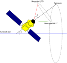
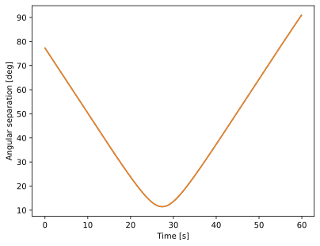

.. _scanning-strategy:

Scanning strategy
=================

The LiteBIRD Simulation Framework provides a set of tools to simulate
the orbit of the spacecraft and to compute the directions where each
detector is looking at the sky, as a function of time. The time stream
of directions and orientations of each detector is usually called
*pointing information*, and we'll consistently use this jargon in the
documentation.

Note that this chapter only deals with the *direction* some detector
is looking at, but the actual position/velocity of the spacecraft is
not needed to do this calculation. The framework provide other
facilities to compute this information, and they are described in
:ref:`dipole-anisotropy`.

This chapter provides an in-depth explanation about how to use the
facilities provided by the framework to compute the pointing
information for any detector in one of the focal planes.

The spacecraft's motion
-----------------------

In the case of a space mission like LiteBIRD, the motion of the
spacecraft and its structure decide where each detector is looking at
each time. The following video shows qualitatively which kind of
motion is simulated by our framework:

.. raw:: html

    <iframe
        width="560"
        height="315"
        src="https://www.youtube.com/embed/Nh7pMSrVDZs"
        frameborder="0"
        allow="accelerometer; autoplay; encrypted-media; gyroscope; picture-in-picture"
        allowfullscreen>
    </iframe>

(The animation was created using `POV-Ray <http://povray.org/>`_, and
the files used to create it are available on `GitHub
<https://github.com/ziotom78/povray_scanning_strategy>`_ .)

You can see that there are *two* rotations in the animation: the
spacecraft spins quickly around its spin axis (grey axis), but this
axis does not stand still: it performs a precession around the blue
axis, which represents the Sun-Earth direction. (You should imagine
the Earth on the left, and the Sun on the very far left.)

Note that the detectors are not necessarily aligned with the spin
axis; in fact, the animation shows the actual direction of observation
for two different detectors as two red and green lines: you can see
that they are looking quite at two opposite sides of the spin axis.
Every detector looks along its own direction, but detectors belonging
to the same instrument (e.g., LFT) look not far away from each other;
it is customary to express their pointing directions relative to an
«average» direction, called the *boresight direction*, which is the
main optical axis of the instrument. Since in LiteBIRD there are
*three* instruments (LFT, MFT, HFT), there should be *three* boresight
directions; however, MFT and HFT share the same telescope, and thus
it's customary to show only one boresight for both. This is the true
meaning of the red and green axes in the video above: the red axis
represents the «average» direction where LFT detectors are looking at,
and the green axis is the same for MFT/HFT.

The animation does not show a *third* rotation happening, which is the
revolution of the spacecraft around the Sun, taking one year to
complete. (Including it in the video would have been useless, as it is
*really* slow when compared with the spin and precession!). This means
that the motion of the spacecraft is the composition of *three*
rotations:

1. Rotation of the spacecraft around the spin axis (grey line);

2. Rotation (precession) of the spin axis around the Sun-Earth axis
   (blue line);

3. Yearly rotation of the Sun-Earth axis around the Sun.

If you think about it, you will realize that the kinematics of this
motion can be fully described by the following quantities:

- The angle between the spin axis and the boresight direction(s),
  usually called β;

- The angle between the spin axis and the Sun-Earth axis, usually
  called α.

- The speed of the rotation of the boresight direction around the spin
  axis;

- The speed of the precession around the Sun-Earth axis, which is
  usually slower than the rotation speed;

They are sketched in the following diagram:

These parameters define the so-called *scanning strategy*, i.e., the
way the instruments observe the sky during the mission's lifetime. The
LiteBIRD Simulation Framework provides all the tools necessary to
simulate the composition of these rotations, and it can produce
pointing information from the synthetic description of the scanning
strategy. Here is a full example, using the scanning strategy proposed
for CORE (:cite:`2018:core:delabrouille`), which is qualitatively
similar to what is going to be used for LiteBIRD:

.. testcode::

  import litebird_sim as lbs
  import astropy.units as u
  import numpy as np

  sim = lbs.Simulation(
      start_time=0,
      duration_s=60.0,
      description="Simple simulation",
      random_seed=12345,
  )

  # We now simulate the motion of the spacecraft over a time span
  # of one minute (specified in the `duration_s` parameter above).
  sim.set_scanning_strategy(
      scanning_strategy=lbs.SpinningScanningStrategy(
          spin_sun_angle_rad=np.deg2rad(30), # CORE-specific parameter
          spin_rate_hz=0.5 / 60.0,     # Ditto
          # We use astropy to convert the period (4 days) in
          # seconds
          precession_rate_hz=1.0 / (4 * u.day).to("s").value,
      )
  )

  # Here we specify the β angle of the focal plane of
  # the instrument
  sim.set_instrument(
      lbs.InstrumentInfo(
          name="core",
          spin_boresight_angle_rad=np.deg2rad(65),
      ),
  )

  # We include a fake boresight detector `det`, belonging
  # to the instrument `core` (unlike LiteBIRD, CORE had only one focal
  # plane and one instrument)
  det = lbs.DetectorInfo(name="foo", sampling_rate_hz=10)

  # By default, `create_observations` creates just *one* observation
  obs, = sim.create_observations(detectors=[det])

  # Prepare the quaternions needed to compute the pointings, i.e.,
  # the direction in the sky where the detector is looking at as
  # a function of time
  sim.prepare_pointings()

  # `get_pointings()` returns both the pointing matrix and the
  # HWP angle; we ignore the latter with `_`, as we do not have
  # a HWP here. The pointing matrix contains the angles (θ, φ, ψ)
  # for each sample in the TOD and each detector.
  pointings, _ = obs.get_pointings(0)

  print("Shape:", pointings.shape)
  print("Pointings:")
  print(np.array_str(pointings, precision=3))

.. testoutput::

  Shape: (600, 3)
  Pointings:
  [[ 2.182 -0.    -1.571]
   [ 2.182 -0.006 -1.576]
   [ 2.182 -0.012 -1.582]
   ...
   [ 0.089 -2.967 -1.738]
   [ 0.088 -3.021 -1.687]
   [ 0.087 -3.075 -1.635]]

All the details in this code are explained in the next sections, so
for now just keep in mind the overall shape of the code:

1. Once the duration of the simulation (one minute in the example
   above) is set, we call the method
   :meth:`.Simulation.set_scanning_strategy`, which forces the
   framework to compute how the orientation of the spacecraft with
   respect to the sky sphere evolves with time. This method produces a
   set of `quaternions <https://en.wikipedia.org/wiki/Quaternion>`_,
   which encode the result of the composition of all the rotations
   (spin, precession, revolution around the Sun) described above;
   these quaternions are saved in the ``spin2ecliptic_quats`` field of
   the ``sim`` class.

2. When the simulation code needs to determine where a detector is
   pointing to (the detector ``det`` in our example), the quaternions
   are used to retrieve (1) the coordinates on the Sky sphere, and (2)
   the orientation angle (ψ). Both quantities are computed in the
   Ecliptic reference frame using the sampling rate of the detector,
   which in our example is 10 Hz (i.e., ten samples per second). In
   the example above, this is done by the function
   :func:`.get_pointings`.

3. The method :meth:`.Observation.get_pointings` returns a ``(N, 3)``
   matrix, where the first column contains the colatitude
   :math:`\theta`, the second column the longitude :math:`\phi`, and
   the third column the orientation angle :math:`\psi`, all expressed
   in radians. These angles are expressed in the Ecliptic Coordinate
   System, where the Equator is aligned with the Ecliptic Plane of
   the Solar System.

Computing the spacecraft's orientation
--------------------------------------

To compute where a detector is looking at the sky sphere, there is a
number of transformations that need to be carried out:

We start from the detector's reference frame, which assumes that the
main beam of the radiation pattern is aligned with the `z` axis, and
that the beam of the detector is oriented using the `x` axis as the
reference axis. (In other words, the `x` axis provides a reference frame
for asymmetric beams.)

The next reference frame is the *boresight*, and to convert from the
detector's reference frame to the boresight there is a rotation, which
is encoded in a rotation quaternion that is saved in the IMO. The framework
implements the class :class:`.RotQuaternion` to encode a rotation
quaternion; this class can model time-varying rotations as well, which
can be useful to simulate vibrations and wobbles in the optical structure
of the instruments.

Next, we move from the reference frame of the boresight to that of the
spacecraft. The information about the placement of the boresight with
respect to the spin axis is encoded in the class
:class:`.InstrumentInfo`. After this transformation, the spin axis is
aligned with the `z` axis.

The next transformation goes from the spacecraft's to the Ecliptic
reference frame; the Ecliptic is on the `xy` plane, and the `z` axis
points towards the Ecliptic North Pole. In this case, the framework
provides two ways to compute the transformation:

1. The revolution of the Earth around the Sun is modelled using a
   plain circular motion, and the starting position is arbitrary; this
   mode is triggered whenever the time is tracked using floating-point
   numbers (i.e., the parameter `start_time` in the constructor of
   :class:`.Simulation` is a ``float``).

2. The proper motion of the Earth around the Sun is computed using
   ephemeridis tables; the calculation is much slower, but the result
   enables to properly simulate the observation of moving objects in
   the Solar System, like planets or asteroids. In this case, the
   parameter `start_time` must be an instance of the class
   ``astropy.time.Time``. In the example above, we would enable the
   computation of proper Earth's motion with the following small
   change::

     import astropy.time

     sim = lbs.Simulation(
         # Turn on full computation of the Earth's orbit around the Sun
         start_time=astropy.time.Time("2020-01-01"),
         duration_s=60.0,
         description="Simple simulation",
         random_seed=12345,
     )

You should compute the proper motion of the Earth around the Sun only
if you absolutely need to, as the computation can be 10÷100 times
slower.

From quaternions to detector pointings
~~~~~~~~~~~~~~~~~~~~~~~~~~~~~~~~~~~~~~

To compute the pointing information for a detector, the quaternions
computed through the call to
:meth:`.Simulation.set_scanning_strategy` are not enough, as
they only tell how to convert a vector from the *spin axis* reference
frame to the Ecliptic reference frame. We need two more quaternions
that tell how to convert from the reference frame of the detector to
that of the spin axis:

1. The first quaternion describes how the detector reference frame
   (with the `z` axis aligned with the main axis of the radiation
   pattern) can be converted to the reference frame of the focal plane
   (with the `z` axis aligned with the boresight). This information is
   included in the IMO and is properly initialized if you call
   :meth:`.DetectorInfo.from_imo`. If you do not specify any
   quaternion, the constructor for :class:`.DetectorInfo` will assume
   that the detector is looking at the boresight, and it will thus create
   a default :class:`.RotQuaternion` object, which corresponds to the
   identity quaternion :math:`(0 0 0 1)`; this is the case of the simple
   example we presented above.

2. The second quaternion describes how to convert the reference frame
   of the focal plane (with the `z` axis aligned with the boresight)
   to the reference frame of the spacecraft (where the `z` axis is
   aligned with its spin axis). This quaternion is stored in the field
   ``bore2spin_quat`` of the class :class:`.InstrumentInfo`, and it is
   initialized when you call the method
   :meth:`.Simulation.set_scanning_strategy`.

The LiteBIRD Simulation Framework recomputes the orientation of the
spacecraft with a regular spacing in time (the default is one minute).
However, pointings need to be known at the same sampling frequency
used by the detector, which is usually much higher than the frequency
used to compute the quaternions (in our example above, the sampling
frequency of detector ``det`` was 10 Hz, but the sampling frequency of
the quaternions was 1/60 Hz). Since the framework uses quaternions to
encode the orientation of the spacecraft, oversampling them to the
sampling frequency of the detector is just a matter of applying a
spherical linear interpolation (abbr. `slerp
<https://en.wikipedia.org/wiki/Slerp>`_), according to the following
figure:

To be sure to include an additional quaternion *after* the last
sample, like in the figure above, the framework provides the static
method :meth:`.ScanningStrategy.optimal_num_of_quaternions`, which
computes how many quaternions need to be calculated to cover some time
span with a given interval between quaternions. For instance, if our
simulation lasts 100 s and we want one quaternion every minute, then
the expected number of quaternions to be computed is 3: one at
:math:`t = 0`, one at :math:`t = 60\,\mathrm{s}`, and one at :math:`t
= 120\,\mathrm{s}`, so that the latter two can be interpolated for the
samples in the range :math:`60\,\mathrm{s} \leq t \leq
100\,\mathrm{s}`. Here is how the function works:

.. testcode::

   print(lbs.ScanningStrategy.optimal_num_of_quaternions(
       time_span_s=100,
       delta_time_s=60,
   ))

.. testoutput::

   3

When using MPI, the relatively small size in memory of the quaternions
(the thick black lines in the figure) enables the framework to keep
a duplicate of the list in all the MPI processes. This is unlike
what happens with the data in TODs (the thin gray lines), which are
split in several blocks inside the :class:`.Observation` class.

.. note::

   Slerp assumes a rotation with constant angular speed and axis
   between consecutive quaternions, and thus it only approximates the
   true composition of all the rotations (spin, precession, revolution
   around the Sun) that we have discussed above. However, don't forget
   that the *real* spacecraft will follow a scanning strategy that
   will be more complex than the one described by our geometrical
   model, because of many non-idealities that are unavoidable in a
   spacecraft. The approximation of the «slerp» operation is thus
   unlikely to be relevant.

Once all the quaternions have been computed at the proper sampling
rate, the direction of the detector on the sky and its orientation
angle can be computed via a call to :meth:`.Observation.get_pointings`.
The calculation works as follows:

- The direction is the vector :math:`\vec d = R \hat e_z`, where
  :math:`R` is the overall rotation from the detector's reference
  frame to the Ecliptic reference frame, and :math:`\hat e_z = (0, 0,
  1)` is the one-length vector aligned with the `z` axis.

- The orientation angle is given by the angle between the North
  direction passing through the vector :math:`\vec d` (i.e., along the
  meridian of :math:`\vec d`) and the vector :math:`\vec p = R \hat
  e_x`, where :math:`R` is the same as above and :math:`\hat e_x = (1,
  0, 0)`, as shown in the following figure (note that :math:`\hat e_x`
  has been drawn twice because the one in the upper side represents
  the orientation direction in the detector's reference frame):

  .. image:: images/orientation-direction.svg

The purpose of the method :meth:`.Simulation.prepare_pointings`, used
in the example at the beginning of this chapter, is to combine the
quaternions that model the transformations between the many reference
frames used in the framework. These quaternions are then used by
the method :meth:`.Observation.get_pointings` to compute the
actual pointing directions and the HWP angle on the fly.

To save memory,:meth:`.Observation.get_pointings` does *not* save the
pointings in a variable once they are calculated, and so they must be
recomputed every time you need them. However, in some applications,
pointings need to be accessed several times during a simulation and these
repeated computations can introduce a noticeable slowdown in the code.

If you want to trade speed with memory occupation, you can use the function
:func:`.precompute_pointings` to compute all the pointings at once and save
them into every :class:`.Observation` objects. This function fills the fields
`pointing_matrix` and `hwp_angle`. The datatype for the pointings is 
specified by ``pointings_dtype``. This can be done either with the low level 
functions   ::

    obs = sim.create_observations(detectors=[det])
    lbs.prepare_pointings(obs,sim.instrument,sim.spin2ecliptic_quats)
    lbs.precompute_pointings(obs, pointings_dtype=np.float64)

or with the methods of the :class:`.Simulation`::

    sim.create_observations(detectors=[det])
    sim.prepare_pointings()
    sim.precompute_pointings(pointings_dtype=np.float64)

How the boresight is specified
------------------------------

As LiteBIRD includes three focal planes and two telescopes, the
specification of the boresight requires some care. In
:cite:`2018:core:delabrouille` and :cite:`2019:pico:hanany`, the
boresight direction is encoded using just one number, the angle
between the boresight and the spin axis. However, both papers deal
with spacecrafts hosting only *one* focal plane.

The full orientation of the boresight direction is specified using
three angles:

1. The ψ angle encodes the rotation of the focal plane with respect to
   the boresight direction itself, and it is ideally 0°;

2. The angle between the boresight direction and the spin axis is
   usually notated with the symbol β (among the three, this is the
   most important number: it's 65° for CORE, 69° for PICO);

3. Finally, the boresight can be rotated by an angle φ around the spin
   axis: this is important only when you have more than one focal
   plane. For LiteBIRD, :math:`\phi_\text{LFT} - \phi_\text{MHFT}
   \approx 180^\circ`.

.. raw:: html

   <iframe
       width="560"
       height="315"
       src="https://www.youtube.com/embed/WbV_7nKXM1c"
       frameborder="0"
       allow="accelerometer; autoplay; encrypted-media; gyroscope; picture-in-picture"
       allowfullscreen>
   </iframe>

Interpretation of pointings
---------------------------

With «pointing», we refer to two different concept:

1. The direction where the detector is looking at;

2. The orientation of the detector while it's looking at the sky.

The direction can be encoded either as a one-length vector ``(x, y,
z)`` or as a couple of angles; the LiteBIRD simulation framework
adopts the second option to save memory, and it encodes directions
using the colatitude (i.e., 90° minus the latitude) and the longitude,
commonly indicated with the letters θ (colatitude) and φ (longitude).

The orientation of the detector (second point above) can be expressed
either as a vector that is tangent to the sky sphere, or as an angle
calculated with respect to the meridian/parallel going through the
point the detector is looking at. Again, to reduce memory usage, our
framework only encodes the angle.

The method :meth:`.Observation.get_pointings` returns two matrices: a
“pointing matrix”, laid in memory as a :math:`(N, 3)` matrix, where
:math:`N` is the number of samples in the timeline, and the last
dimension holds the colatitude, longitude, and orientation (in
radians). The second matrix contains the angle of the HWP. Let's
visualize the position of these pointings on a Healpix map::

   import healpy, numpy as np
   import matplotlib.pylab as plt

   nside = 64
   pixidx = healpy.ang2pix(nside, pointings[:, 0], pointings[:, 1])
   m = np.zeros(healpy.nside2npix(nside))
   m[pixidx] = 1
   healpy.mollview(m)

Custom scanning strategies
--------------------------

In this section we explain how scanning strategies different from the
nominal, «spinning» strategy can be modelled. You will need to
understand the functions provided by the framework to deal with
quaternions.

The framework uses a right-handed coordinate system, like the one
shown in figure:

.. image:: images/right-handed-coordinates.svg

where the grey arrows indicate the verse of *positive* rotations (they
follow the usual right-hand rule: point your thumb along the axis, and
the other fingers will point towards the positive direction of the
rotation).

A few words about quaternions
~~~~~~~~~~~~~~~~~~~~~~~~~~~~~

To describe a rotation in 3D space, there are several choices: `Euler
angles <https://en.wikipedia.org/wiki/Euler_angles>`_, `rotation
matrices <https://en.wikipedia.org/wiki/Rotation_matrix>`_,
`quaternions <https://en.wikipedia.org/wiki/Quaternion>`_, etc. Each
of these systems has its own share of advantages and disadvantages:
for instance, rotation matrices are handy when you have a vector and
want to rotate it, as it's just a matter of doing a matrix-vector
multiplication. Quaternions are more complicated on this regard, but
they offer a mathematical operation called *slerp* (shorthand for
*spherical linear interpolation*), which is incredibly useful and not
available with other representations, like rotation matrices. We
assume that the reader knows what quaternion are and their
mathematical properties; if you are not, be sure to read the book
*Visualizing quaternions*, by Andrew J. Hanson (Elsevier, 2006,
ISBN-0080474772) and the provocative essay by Marc ten Bosch, `Let's
remove Quaternions from every 3D engine
<https://marctenbosch.com/quaternions/>`_.

The LiteBIRD simulation framework models quaternions using the
convention :math:`(v_x, v_y, v_z, w)`; be aware that some textbooks
use the order :math:`(w, v_x, v_y, v_z)`. As the framework uses
quaternions only to model rotations, they all must obey the relation
:math:`v_x^2 + v_y^2 + v_z^2 + w^2 = 1` (*normalized* quaternions),
which is a property satisfied by rotation quaternions.

The class :class:`.RotQuaternion` can model time-varying quaternions.
It is enough to provide a list of quaternions, a starting time, and
a sampling frequency, which is assumed to be constant::

    import litebird_sim as lbs

    time_varying_quaternion = lbs.RotQuaternion(
        # Three rotation quaternions
        quats=np.array(
            [
                [0.5, 0.0, 0.0, 0.8660254],
                [0.0, -0.38268343, 0.0, 0.92387953],
                [0.0, 0.0, 0.30901699, 0.95105652],
            ]
        ),
        start_time=0.0,
        sampling_rate_hz=1.0,
    )

This example assumes that ``time_varying_quaternion`` describes a
rotation that evolves with time, starting from ``t = 0`` and lasting
3 seconds, as the sampling frequency is 1 Hz.

Rotation quaternions can be multiplied together; however, they must refer
to the same starting time and have the same sampling frequency.

Python functions for quaternions
~~~~~~~~~~~~~~~~~~~~~~~~~~~~~~~~

The LiteBIRD Simulation Framework provides three functions,
:func:`.quat_rotation_x`, :func:`.quat_rotation_y`, :func:`.quat_rotation_z` to
compute simple rotation quaternions; they return plain the normalized
quaternion representing a rotation by an angle :math:`\theta` around
one of the three axis `x`, `y`, and `z`. These quaternions are plain
NumPy arrays and can be passed to the parameter ``quats`` of the
constructor for :class:`.RotQuaternion`:

.. testcode::

  import litebird_sim as lbs
  import numpy as np

  def print_quaternion(q):
      print("{:.3f} {:.3f} {:.3f} {:.3f}".format(*q))

  print("Rotation by π/3 around x:")
  print_quaternion(lbs.quat_rotation_x(theta_rad=np.pi/3))
  print("Rotation by π/3 around y:")
  print_quaternion(lbs.quat_rotation_y(theta_rad=np.pi/3))
  print("Rotation by π/3 around z:")
  print_quaternion(lbs.quat_rotation_z(theta_rad=np.pi/3))

.. testoutput::

   Rotation by π/3 around x:
   0.500 0.000 0.000 0.866
   Rotation by π/3 around y:
   0.000 0.500 0.000 0.866
   Rotation by π/3 around z:
   0.000 0.000 0.500 0.866

There are two functions that implement in-place multiplication of
quaternions: :func:`.quat_right_multiply` performs the calculation
:math:`r \leftarrow r \times q`, and :func:`.quat_left_multiply`
performs the calculation :math:`r \leftarrow q \times r` (where
:math:`\leftarrow` indicates the assignment operation):

.. testcode::

  quat = np.array(lbs.quat_rotation_x(np.pi / 3))
  lbs.quat_left_multiply(quat, *lbs.quat_rotation_z(np.pi / 2))
  print("Rotation by π/3 around x and then by π/2 around z:")
  print_quaternion(quat)

.. testoutput::

   Rotation by π/3 around x and then by π/2 around z:
   0.354 0.354 0.612 0.612

Note the syntax for :func:`.quat_left_multiply`: you are supposed to
pass the four components of the quaternion :math:`q` as separate
arguments, and thus we need to prepend the call to ``lbs.quat_rotation_z``
with ``*`` to expand the result (a 4-element tuple) into the four
parameters required by :func:`.quat_left_multiply`. The reason for
this weird syntax is efficiency, as this kind of function call can be
easily optimized by Numba (which is used extensively in the code).

Finally, the framework provides the function :func:`.rotate_vector`,
which applies the rotation described by a normalized quaternion to a
vector. There are faster versions in :func:`.rotate_x_vector`,
:func:`.rotate_y_vector`, and :func:`.rotate_z_vector` that rotate the
three basis vectors ``(1, 0, 0)``, ``(0, 1, 0)``, and ``(0, 0, 1)``.
The functions :func:`.all_rotate_vectors`,
:func:`.all_rotate_x_vectors`, :func:`.all_rotate_y_vectors`, and
:func:`.all_rotate_z_vectors` can be applied to arrays of quaternions
and vectors.

A simple scanning strategy
~~~~~~~~~~~~~~~~~~~~~~~~~~

We are now ready to discuss how to implement other types of scanning
strategies. There are plenty of reasons why one would like to go
beyond the class :class:`.SpinningScanningStrategy`:

1. You want to study the effect of non-idealities, like second-order
   effects caused by contractions/dilations in the mechanical
   structure of the telescope that make the angle between the spin
   axis and the boresight vary with time.

2. You are thinking about how to make dedicated observations of some
   celestial source (e.g., the Crab Nebula) for the purpose of
   calibrating the instruments.

To define a new scanning strategy, we define a descendeant of the
:class:`.ScanningStrategy` class, an `Abstract Base Class (ABC)
<https://docs.python.org/3/library/abc.html>`_; the only method that
must be defined is
:meth:`.ScanningStrategy.generate_spin2ecl_quaternions`, which takes
as inputs the start time, the length of the simulation, and the time
interval to be used between consecutive quaternions. The method must
return an instance of the :class:`.RotQuaternion`, containing the
computed sequence of quaternions.

We'll code here a very simple scanning strategy, which does not
involve anything fancy: the spacecraft will just spin around the
Sun-Earth axis, and the boresight direction will be along the same
spin axis. Thus, the boresight detector is going to see only the
points along the Ecliptic plane. This scanning strategy is
scientifically useless, but it's simple enough to be implemented in a
few lines of code:

1. The transformation from boresight to the spin axis reference frame
   is the identity;
2. There is no precession of the spin axis; therefore, the latter
   stays on the Ecliptic axis;
3. The only rotation is caused by the revolution of the Sun-Earth axis
   around the Sun, which is implemented as a rotation on the `xy`
   plane, i.e., around the `z` axis.

The following code implements our mock scanning strategy::

   class SimpleScanningStrategy(lbs.ScanningStrategy):
       def generate_spin2ecl_quaternions(
           self,
           start_time: Union[float, astropy.time.Time],
           time_span_s: float,
           delta_time_s: float,
       ) -> RotQuaternion:
           # Compute how many quaternions are needed to cover
           # the time interval specified by "time_span_s"
           num_of_quaternions = (
               lbs.ScanningStrategy.optimal_num_of_quaternions(
                   time_span_s=time_span_s,
                   delta_time_s=delta_time_s,
               )
           )

           # Make room for the quaternions
           spin2ecliptic_quats = np.empty((num_of_quaternions, 4))

           # We compute the times when the quaternions need to be
           # calculated. Note that ScanningStrategy returns two
           # arrays ("time" and "time_s"), but we neglect the second
           # because we don't need it in this very simple case
           (time, _) = lbs.ScanningStrategy.get_times(
               start_time=start_time,
               delta_time_s=delta_time_s,
               num_of_quaternions=num_of_quaternions,
           )

           # Compute the angle on the Ecliptic plane between the x
           # axis and the Sun-Earth axis, possibly using AstroPy
           sun_earth_angles_rad = (
               lbs.calculate_sun_earth_angles_rad(time)
           )

           # This code is *not* optimized: in a real-world case,
           # you'll probably want to use Numba instead of the
           # following "for" loop
           for i in range(num_of_quaternions):
               # Rotate by 90° around the y axis (move the boresight
               # to the Ecliptic xy plane)
               spin2ecliptic_quats[i, :] = lbs.quat_rotation_y(np.pi / 2)

               # Simulate the revolution of the spacecraft around
               # the Sun using the angles computed above
               lbs.quat_left_multiply(
                   spin2ecliptic_quats[i, :],
                   *lbs.quat_rotation_z(sun_earth_angles_rad[i]),
               )

           # Return the quaternions wrapped in an instance of
           # "RotQuaternion"
           return lbs.RotQuaternion(
               start_time=start_time,
               pointing_freq_hz=1.0 / delta_time_s,
               quats=spin2ecliptic_quats,
           )

To test the class ``SimpleScanningStrategy``, we write some code very
similar to the example presented at the beginning of this section.
However, we cannot run the simulation for just one hour, as it would
be not enough to see any change in the pointing direction: the only
things that changes as time passes is the position of the Earth on the
Ecliptic plane, and it takes 365 days to do one revolution. Therefore,
we extend the length of the simulation to 365 days. Of course, there
is no need to use an high sampling frequency in our example, so we use
here just one sample per day; for the same reason, instead of
computing one quaternion every minute, we compute one quaternion every
30 days::

   import astropy.units as u
   import healpy
   import numpy as np

   sim = lbs.Simulation(
       start_time=0,
       duration_s=(365 * u.day).to("s").value,
       description="Simple simulation",
       random_seed=12345,
   )

   sim.set_scanning_strategy(
       scanning_strategy=SimpleScanningStrategy(),
       delta_time_s=(30 * u.day).to("s").value
   )

   det = lbs.DetectorInfo(
       name="foo",
       sampling_rate_hz=1.0 / ((1.0 * u.day).to("s").value),
   )
   (obs,) = sim.create_observations(detectors=[det])
   pointings = lbs.get_pointings(obs, sim.spin2ecliptic_quats, np.array([det.quat]))

   m = np.zeros(healpy.nside2npix(64))
   pixidx = healpy.ang2pix(64, pointings[:, 0], pointings[:, 1])
   m[pixidx] = 1
   healpy.mollview(m)

Here is the result: we're indeed scanning the Ecliptic plane!

Half Wave Plate
---------------

The rotation of the polarization angle induced by a HWP can be
included in the returned pointing information by passing an instance
of a descendant of the class :class:`.HWP` to the method
:meth:`.Simulation.set_hwp`. Here is an example::

    import litebird_sim as lbs

    sim = lbs.Simulation(
        start_time=0,
        duration_s=100.0,
        random_seed=12345,
    )

    sim.set_scanning_strategy(
        lbs.SpinningScanningStrategy(
            spin_sun_angle_rad=0.785_398_163_397_448_3,
            precession_rate_hz=8.664_850_513_998_931e-05,
            spin_rate_hz=0.000_833_333_333_333_333_4,
            start_time=sim.start_time,
        ),
        delta_time_s=60,
    )

    sim.set_instrument(
        instr = lbs.InstrumentInfo(
            boresight_rotangle_rad=0.0,
            spin_boresight_angle_rad=0.872_664_625_997_164_8,
            spin_rotangle_rad=3.141_592_653_589_793,
        )
    )

    sim.set_hwp(
        lbs.IdealHWP(ang_speed_radpsec=4.084_070_449_666_731),
    )

    det = lbs.DetectorInfo(
        name="Boresight_detector",
        sampling_rate_hz=1.0,
        quat=[0.0, 0.0, 0.0, 1.0],
    )
    obs, = sim.create_observations(detectors=[det])

    sim.prepare_pointings()

This example uses the :class:`.IdealHWP`, which represents an ideal
spinning HWP.

Observing point sources in the sky
----------------------------------

It is useful to simulate the observation of point sources in the sky,
both for a scientific purpose or for instrument calibration. For
instance, an important task in the calibration of a CMB space
experiment is the estimation of the radiation pattern
:math:`\gamma(\theta, \phi)` for each detector (sometimes
:math:`\gamma` is called the *beam function*). This task can be done
through the observation of a bright point source, like one of the
outer planets (Mars, Jupiter, Saturn, etc.): assuming that the source
is really pointlike and neglecting every other emission from the sky,
the response measured by a detector is proportional to the radiation
pattern :math:`\gamma(\theta, \phi)`, where the angles :math:`\theta,
\phi` identify the position of the planet *in the reference frame of
the detector*, i.e., where :math:`\theta = 0` is the direction of the
main beam axis.

The functions described in this chapter can be used to analyze how
detectors are going to observe point sources in the sky, properly
taking into account proper motions of the sources (this applies to
Solar System objects, like planets and comets). The library
provides the functions
:func:`.get_ecl2det_quaternions`, which has the same syntax as
:func:`.get_pointings` but returns a matrix with shape ``(N, 4)``
containing the ``N`` quaternions that transform from the Ecliptic
reference frame to the detector's. Thus, this method can be used to
estimate how far from the main beam axis a celestial object is, and
its orientation with respect to the orientation of the detector.

Here we show a simple example; the first part is identical to the
examples shown above (using the same scanning strategy as CORE's), but
here we employ AstroPy to compute the Ecliptic coordinates of Jupiter
during the simulation and convert them in the reference frame of the
boresight detector using :func:`.get_ecl2det_quaternions`:

.. testcode::

  import numpy as np
  import litebird_sim as lbs
  import astropy.time, astropy.units as u
  from astropy.coordinates import (
      ICRS,
      get_body_barycentric,
      BarycentricMeanEcliptic,
      solar_system_ephemeris,
  )

  sim = lbs.Simulation(
      # We use AstroPy times here!
      start_time=astropy.time.Time("2020-01-01T00:00:00"),
      duration_s=60.0,
      description="Simple simulation",
      random_seed=12345,
  )

  sim.set_scanning_strategy(
      scanning_strategy=lbs.SpinningScanningStrategy(
          spin_sun_angle_rad=np.deg2rad(30),
          spin_rate_hz=0.5 / 60.0,
          precession_rate_hz=1.0 / (4 * u.day).to("s").value,
      )
  )

  sim.set_instrument(
      lbs.InstrumentInfo(
          name="core",
          spin_boresight_angle_rad=np.deg2rad(65),
      ),
  )

  det = lbs.DetectorInfo(name="foo", sampling_rate_hz=10)
  obs, = sim.create_observations(detectors=[det])

  #################################################################
  # Here begins the juicy part

  solar_system_ephemeris.set("builtin")

  # The variable "icrs_pos" contains the x,y,z coordinates of Jupiter
  # in the ICRS reference frame for each sample time in the
  # observation.
  icrs_pos = get_body_barycentric(
      "jupiter",
      obs.get_times(astropy_times=True),
  )
  # Convert the ICRS r.f. into the barycentric mean Ecliptic r.f.,
  # which is the reference frame used by the LiteBIRD simulation
  # framework
  ecl_vec = (ICRS(icrs_pos)
      .transform_to(BarycentricMeanEcliptic())
      .cartesian
      .get_xyz()
      .value
  )

  # The variable ecl_vec is a 3×N matrix containing the vectors.
  # We normalize them so that each has length one (using the L_2
  # norm, hence ord=2)
  ecl_vec /= np.linalg.norm(ecl_vec, axis=0, ord=2)

  # Convert the matrix to a N×3 shape
  ecl_vec = ecl_vec.transpose()

  # Calculate the quaternions that convert the Ecliptic
  # reference system into the detector's reference system
  quats = lbs.get_ecl2det_quaternions(
      obs,
      sim.spin2ecliptic_quats,
      bore2spin_quat=sim.instrument.bore2spin_quat,
      detector_quats=[det.quat],
  )

  # Make room for the xyz vectors in the detector's reference frame
  det_vec = np.empty_like(ecl_vec)

  # Do the rotation!
  lbs.all_rotate_vectors(det_vec, quats[0], ecl_vec)

  print(det_vec)

.. testoutput::

  [[ 0.57053937  0.07219102 -0.81809124]
   [ 0.57038372  0.06957116 -0.8184267 ]
   [ 0.57023386  0.0669494  -0.81874973]
   ...
   [ 0.99293109 -0.0800506   0.08763421]
   [ 0.99310516 -0.07743726  0.08800916]
   [ 0.99327345 -0.07482179  0.08837171]]

Again, the vectors printed by this script are in the *reference frame
of the detector*, where the vector ``[0 0 1]`` indicates the main axis
of the detector. We can inspect how close Jupiter moves to the main
beam axis during the simulation if we convert the set of `(x, y, z)`
vectors into the angles :math:`\theta` (colatitude) and :math:`\phi`
(longitude), as the colatitude is simply the angular distance from the
main beam axis (:math:`\theta = 0`)::

  import healpy
  theta, phi = healpy.vec2ang(det_vec)

  import matplotlib.pylab as plt

  times = obs.get_times()
  plt.plot(times - times[0], np.rad2deg(theta))
  plt.xlabel("Time [s]")
  plt.ylabel("Angular separation [deg]")

We see that Jupiter is ~10° away from the beam axis after ~30 seconds
since the start of the simulation.

API reference
-------------

.. automodule:: litebird_sim.scanning
    :members:
    :undoc-members:
    :show-inheritance:

.. automodule:: litebird_sim.pointings
    :members:
    :undoc-members:
    :show-inheritance:

.. automodule:: litebird_sim.pointings_in_obs
    :members:
    :undoc-members:
    :show-inheritance:

.. automodule:: litebird_sim.hwp
    :members:
    :undoc-members:
    :show-inheritance:

.. automodule:: litebird_sim.quaternions
    :members:
    :undoc-members:
    :show-inheritance:
