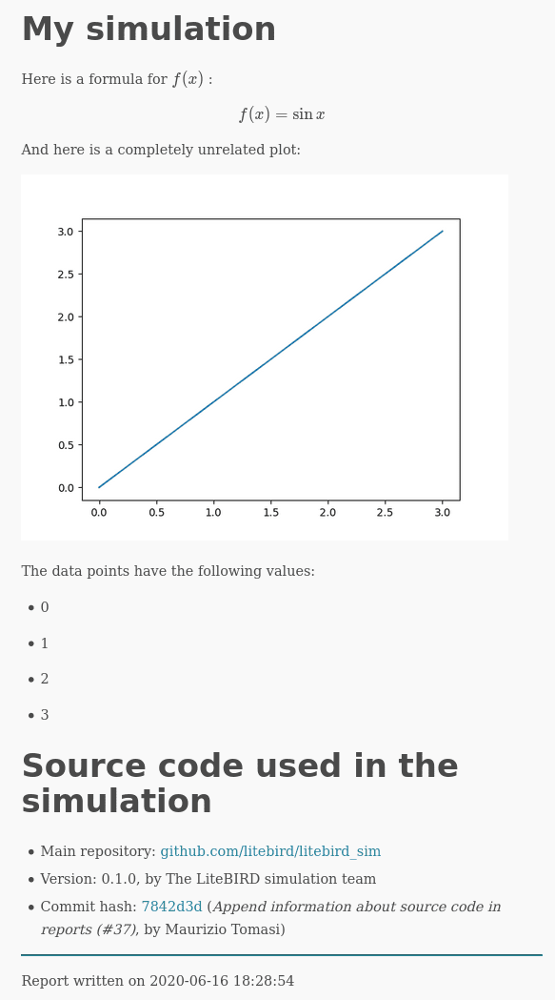

Simulations
===========

The LiteBIRD Simulation Framework is built on the :class:`.Simulation`
class, which should be instantiated in any pipeline built using this
framework. The class acts as a container for the many analysis modules
available to the user, and it offers the following features:

1. Provenance model;
2. Interface with the instrument database;
3. System abstractions;
4. Generation of reports.

Provenance model
----------------

A «provenance model» is, generally speaking, a way to track the
history and origin of a data set by recording the following
information:

1. Who or what created the dataset?
2. Which algorithm or instrumentation was used to produce it?
3. Which steps were undertaken to process the raw data?
4. How can one get access to the raw samples used to produce the
   dataset?

The LiteBIRD Simulation Framework tracks these information using
parameter files (in TOML format) and generating reports at the end of
a simulation.

.. _parameter_files:

Parameter files
---------------

When you run a simulation, there are typically plenty of parameters
that need to be passed to the code: the resolution of an output map,
the names of the detectors to simulate, whether to include synchrotron
emission in the sky model, etc.

The :class:`Simulation` class eases this task by accepting the path to
a TOML file as a parameter (``parameter_file``). Specifying this
parameter triggers two actions:

1. The file is copied to the output directory where the simulation
   output files are going to be written;
2. The file is read and made available in the field ``parameters`` (a
   Python dictionary).

The parameter is optional; if you do not specify ``parameter_file``
when creating a :class:`.Simulation` object, the `parameters` field
will be set to an empty dictionary. (You can even directly pass a
dictionary to a :class:`.Simulation` object: this can be handy if you
already constructed a parameter object somewhere else.)
   
Take this example of a simple TOML file:

.. code-block:: toml

   # This is file "my_conf.toml"
   [general]
   nside = 512
   imo_version = "v0.10"

   [sky_model]
   components = ["synchrotron", "dust", "cmb"]

The following example loads the TOML file and prints its contents to
the terminal::

  import litebird_sim as lbs

  sim = lbs.Simulation(parameter_file="my_conf.toml")

  print("NSIDE =", sim.parameters["general"]["nside"])
  print("The IMO I'm going to use is",
        sim.parameters["general"]["imo_version"])

  print("Here are the sky components I'm going to simulate:")
  for component in sim.parameters["sky_model"]["components"]:
      print("-", component)

The output of the script is the following:

.. code-block:: text

    NSIDE = 512
    The IMO I'm going to use is v0.10
    Here are the sky components I'm going to simulate:
    - synchrotron
    - dust
    - cmb

      
The :class:`.Simulation` object does not try to interpret parts of the
parameter file: it's up to the simulation modules to do it.

.. _imo-interface:
   
Interface with the instrument database
--------------------------------------

To simulation LiteBIRD's data acquisition, the simulation code must be
aware of the characteristics of the instrument. These are specified in
the LiteBIRD Instrument Model (IMO) database, which can be accessed by
people with sufficient rights. This Simulation Framework has the
ability to access the database and take the input parameters necessary
for its analysis modules to produce the expected output.

   
System abstractions
-------------------

In some cases, simulations must be ran on HPC computers, distributing
the job on many processing units; in other cases, a simple laptop
might be enough. The LiteBIRD Simulation Framework uses MPI to
parallelize its codes, which is however an optional dependency: the
code can be ran serially.

When creating a :class:`.Simulation` object, the user can tell the
framework to use or not MPI using the flag `use_mpi`::

  import litebird_sim as lbs

  # This simulation must be ran using MPI
  sim = lbs.Simulation(use_mpi = True)

The framework sets a number of variables related to MPI; these
variables are *always* defined, even if MPI is not available, and they
can be used to make the code work in different situations. If your
code must be able to run both with and without MPI, you should
initialize a :class:`.Simulation` object using the variable
:class:`.MPI_ENABLED`::

  import litebird_sim as lbs

  # This simulation can take advantage of MPI, if present
  sim = lbs.Simulation(use_mpi = lbs.MPI_ENABLED)
         
See the page :ref:`using_mpi` for more information.


.. _report-generation:

Generation of reports
---------------------

This section should explain how reports can be generated, first from
the perspective of a library user, and then describing how developers
can generate plots for their own modules.

Here is an example, showing several advanced topics like mathematical
formulae, plots, and value substitution::

    import litebird_sim as lbs
    import matplotlib.pylab as plt

    sim = lbs.Simulation(name="My simulation", base_path="output")
    data_points = [0, 1, 2, 3]

    plt.plot(data_points)
    fig = plt.gcf()

    sim.append_to_report('''
    Here is a formula for $`f(x)`$:

    ```math
    f(x) = \sin x
    ```

    And here is a completely unrelated plot:

    

    The data points have the following values:
    
    - {{ sample }}
    
    ''', figures=[(fig, "myplot.png")],
         data_points=data_points)

    sim.flush()

And here is the output, which is saved in ``output/report.html``:


    

API reference
-------------

.. automodule:: litebird_sim.simulations
    :members:
    :undoc-members:
    :show-inheritance:
