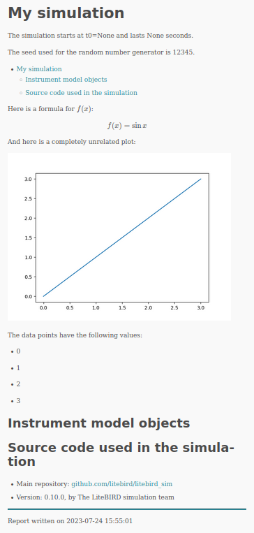

.. _simulations:

Simulations
===========

The LiteBIRD Simulation Framework is built on the :class:`.Simulation`
class, which should be instantiated in any pipeline built using this
framework. The class acts as a container for the many analysis modules
available to the user, and it offers the following features:

1. Provenance model;
2. Interface with the instrument database;
3. System abstractions;
4. Generation of reports;
5. Printing status messages on the terminal (logging).

Provenance model
----------------

A «provenance model» is, generally speaking, a way to track the
history and origin of a data set by recording the following
information:

1. Who or what created the dataset?
2. Which algorithm or instrumentation was used to produce it?
3. Which steps were undertaken to process the raw data?
4. How can one get access to the raw samples used to produce the
   dataset?

The LiteBIRD Simulation Framework tracks these information using
parameter files (in TOML format), accessing the LiteBIRD Instrument
Model (IMO) through the unique identifiers provided by the Data Access
Layer (DAL), and generating reports after the simulation completes.

.. _parameter_files:

Parameter files
---------------

When you run a simulation, there are typically plenty of parameters
that need to be passed to the code: the resolution of an output map,
the names of the detectors to simulate, whether to include synchrotron
emission in the sky model, etc.

The :class:`Simulation` class eases this task by accepting the path to
a TOML file as a parameter (``parameter_file``). Specifying this
parameter triggers two actions:

1. The file is copied to the output directory where the simulation
   output files are going to be written (i.e., the same that contains
   ``report.html``);
2. The file is read and made available in the field
   ``Simulation.parameters`` (a Python dictionary).

Using a parameter file is optional; if you do not specify
``parameter_file`` while creating a :class:`.Simulation` object, the
`parameters` field will be set to an empty dictionary. (You can even
directly pass a dictionary to a :class:`.Simulation` object: this can
be handy if you already constructed a parameter object somewhere
else.)

Take this example of a simple TOML file:

.. code-block:: toml

   # This is file "my_conf.toml"
   [general]
   nside = 512
   imo_version = "v1.3"

   [sky_model]
   components = ["synchrotron", "dust", "cmb"]

The following example loads the TOML file and prints its contents to
the terminal::

  import litebird_sim as lbs

  sim = lbs.Simulation(parameter_file="my_conf.toml")

  print("NSIDE =", sim.parameters["general"]["nside"])
  print("The IMO I'm going to use is",
        sim.parameters["general"]["imo_version"])

  print("Here are the sky components I'm going to simulate:")
  for component in sim.parameters["sky_model"]["components"]:
      print("-", component)

The output of the script is the following:

.. code-block:: text

    NSIDE = 512
    The IMO I'm going to use is v1.3
    Here are the sky components I'm going to simulate:
    - synchrotron
    - dust
    - cmb


A :class:`.Simulation` object only interprets the section
``simulation`` and leaves everything else unevaluated: it's up to the
simulation modules to make sense of any other section. The recognized
parameters in the section named ``simulation`` are the following:

- ``base_path``: a string containing the path where to save the
  results of the simulation.
- ``start_time``: the start time of the simulation. If it is a string
  or a `TOML datetime
  <https://github.com/toml-lang/toml/blob/master/toml.md#user-content-local-date-time>`_,
  it will be passed to the constructor for ``astropy.time.Time``,
  otherwise it must be a floating-point value.
- ``duration_s``: a floating-point number specifying how many seconds
  the simulation should last. You can pass a string, which can contain
  a measurement unit as well: in this case, you are not forced to
  specify the duration in seconds. Valid units are: ``days`` (or
  ``day``), ``hours`` (or ``hour``), ``min``, and ``sec`` (or ``s``).
- ``name``: a string containing the name of the simulation.
- ``description``: a string containing a (possibly long) description
  of what the simulation does.

These parameters can be used instead of the keywords in the
constructor of the :class:`.Simulation` class. Consider the following
code::

  sim = Simulation(
      base_path="/storage/output",
      start_time=astropy.time.Time("2020-02-01T10:30:00"),
      duration_s=3600.0,
      name="My simulation",
      description="A long description should be put here")
  )

You can achieve the same if you create a TOML file named ``foo.toml``
that contains the following lines:

.. code-block:: toml

   [simulation]
   base_path = "/storage/output"
   start_time = 2020-02-01T10:30:00
   duration_s = 3600.0
   name = "My simulation"
   description = "A long description should be put here"

and then you initialize the `sim` variable in your Python code as
follows::

  sim = Simulation(parameter_file="foo.toml")

A nice feature of the framework is that the duration of the mission
must not be specified in seconds. You would achieve identical results
if you specify the duration in one of the following ways:

.. code-block:: toml

   # All of these are the same
   duration_s = "1 hour"
   duration_s = "60 min"
   duration_s = "3600 s"

.. _imo-interface:

Interface with the instrument database
--------------------------------------

To simulation LiteBIRD's data acquisition, the simulation code must be
aware of the characteristics of the instrument. These are specified in
the LiteBIRD Instrument Model (IMO) database, which can be accessed by
people with sufficient rights. This Simulation Framework has the
ability to access the database and take the input parameters necessary
for its analysis modules to produce the expected output.


System abstractions
-------------------

In some cases, simulations must be ran on HPC computers, distributing
the job on many processing units; in other cases, a simple laptop
might be enough. The LiteBIRD Simulation Framework uses MPI to
parallelize its codes, which is however an optional dependency: the
code can be ran serially.

If you want to use MPI in your scripts, assuming that you have created
a virtual environment as explained in the :ref:`tutorial`, you have
just to install `mpi4py <https://mpi4py.readthedocs.io/en/stable/>`_:

.. code-block:: sh

  $ pip install mpi4py

  # Always do this after "pip install", it will record the
  # version number of mpi4py and all the other libraries
  # you have installed in your virtual environment
  $ pip freeze > requirements.txt

  # Run the program using 4 processes
  $ mpiexec -n 4 python3 my_script.py

The framework will detect the presence of ``mpi4py``, and it will
automatically use distributed algorithms where applicable; otherwise,
serial algorithms will be used. You can configure this while creating
a :class:`.Simulation` object::

  import litebird_sim as lbs
  import mpi4py

  # This simulation *must* be ran using MPI
  sim = lbs.Simulation(mpi_comm=mpi4py.MPI.COMM_WORLD)

The framework sets a number of variables related to MPI; these
variables are *always* defined, even if MPI is not available, and they
can be used to make the code work in serial environments too. If your
code must be able to run both with and without MPI, you should
initialize a :class:`.Simulation` object using the variable
:data:`.MPI_COMM_WORLD`, which is either ``mpi4py.MPI.COMM_WORLD``
(the default MPI communicator) or a dummy class if MPI is disabled::

  import litebird_sim as lbs

  # This simulation can take advantage of MPI if present,
  # otherwise it will stick to serial execution
  sim = lbs.Simulation(mpi_comm=lbs.MPI_COMM_WORLD)

See the page :ref:`using_mpi` for more information.


.. _report-generation:

Generation of reports
---------------------

This section should explain how reports can be generated, first from
the perspective of a library user, and then describing how developers
can generate plots for their own modules.

Here is an example, showing several advanced topics like mathematical
formulae, plots, and value substitution::

    import litebird_sim as lbs
    import matplotlib.pylab as plt

    sim = lbs.Simulation(name="My simulation", base_path="output")
    data_points = [0, 1, 2, 3]

    plt.plot(data_points)
    fig = plt.gcf()

    sim.append_to_report('''
    Here is a formula for $`f(x)`$:

    ```math
    f(x) = \sin x
    ```

    And here is a completely unrelated plot:

    

    The data points have the following values:
    
    - {{ sample }}
    
    ''', figures=[(fig, "myplot.png")],
         data_points=data_points)

    sim.flush()

And here is the output, which is saved in ``output/report.html``:




Logging
-------

The report generation tools described above are useful to produce a
synthetic report of the *scientific* outcomes of a simulation.
However, one often wants to monitor the execution of the code in a
more detailed manner, checking which functions have been called, how
often, etc. In this case, the best option is to write messages to the
terminal. Python provides the `logging
<https://docs.python.org/3/library/logging.html>`_ module for this
purpose, and when you initialize a :class:`.Simulation` object, the
module is initialize with a set of sensible defaults. In your code you
can use the functions ``debug``, ``info``, ``warning``, ``error``, and
``critical`` to monitor what's happening during execution::

  import litebird_sim as lbs
  import logging as log       # "log" is shorter to write
  my_sim = lbs.Simulation()
  log.info("the simulation starts here!")
  pi = 3.15
  if pi != 3.14:
      log.error("wrong value of pi!")

The output of the code above is the following:

.. code-block:: text

  [2020-07-18 06:25:27,653 INFO] the simulation starts here!
  [2020-07-18 06:25:27,653 ERROR] wrong value of pi!

Note that the messages are prepended with the date, time, and level of
severity of the message.

A few environment variables can taylor the way logging is done:

- ``LOG_DEBUG``: by default, debug messages are not printed to the
  terminal, because they are often too verbose for typical uses. If
  you want to debug your code, set a non-empty value to this variable.

- ``LOG_ALL_MPI``: by default, if you are using MPI then only messages
  from the process running with rank 0 will be printed. Setting this
  environment variable will make all the processes print their message
  to the terminal. (Caution: there might be overlapping messages, if
  two processes happen to write at the same time.)

The way you use these variable from the terminal is illustrated with
an example. Suppose that we changed our example above, so that
``log.debug`` is called instead of ``log.info``::

  import litebird_sim as lbs
  import logging as log  # "log" is shorter to write

  my_sim = lbs.Simulation()
  log.debug("the simulation starts here!")
  pi = 3.15
  if pi != 3.14:
      log.debug("wrong value of pi!")

In this case, running the script will produce no messages, as the
default is to skip ``log.debug`` calls:

.. code-block:: text

  $ python my_script.py
  $

However, running the script with the environment variable
``LOG_DEBUG`` set will make the messages appear:

.. code-block:: text

  $ LOG_DEBUG=1 python my_script.py
  [2020-07-18 06:31:03,223 DEBUG] the simulation starts here!
  [2020-07-18 06:31:03,224 DEBUG] wrong value of pi!
  $


Monitoring MPI processes
------------------------

When using MPI, the method :meth:`.Simulation.create_observations`
distributes detectors and time spans over all the available
MPI processes. The :class:`.Simulation` class provides a method
that enables the user to inspect how the TOD has been split
among the many MPI processes: :meth:`.Simulation.describe_mpi_distribution`.

The method must be called at the same time on *all* the MPI
processess, once you have successfully called
:meth:`.Simulation.create_observations`::

  import litebird_sim as lbs

  # Be sure to create a `Simulation` object and create
  # the observations:
  #
  #     sim = lbs.Simulation(…)
  #     sim.create_observations(…)

  # Now ask the framework to report how it's using each MPI process
  descr = sim.describe_mpi_distribution()

The return type for :meth:`.Simulation.describe_mpi_distribution`
is :class:`.MpiDistributionDescr`, which can be printed on the
spot using ``print(descr)``. The result looks like the following
example:

.. code-block:: text

    # MPI rank #1

    ## Observation #0
    - Start time: 0.0
    - Duration: 21600.0 s
    - 1 detector(s) (0A)
    - TOD shape: 1×216000
    - TOD dtype: float64

    ## Observation #1
    - Start time: 43200.0
    - Duration: 21600.0 s
    - 1 detector(s) (0A)
    - TOD shape: 1×216000
    - TOD dtype: float64

    # MPI rank #2

    ## Observation #0
    - Start time: 21600.0
    - Duration: 21600.0 s
    - 1 detector(s) (0A)
    - TOD shape: 1×216000
    - TOD dtype: float64

    ## Observation #1
    - Start time: 64800.0
    - Duration: 21600.0 s
    - 1 detector(s) (0A)
    - TOD shape: 1×216000
    - TOD dtype: float64

    # MPI rank #3

    ## Observation #0
    - Start time: 0.0
    - Duration: 21600.0 s
    - 1 detector(s) (0B)
    - TOD shape: 1×216000
    - TOD dtype: float64

    ## Observation #1
    - Start time: 43200.0
    - Duration: 21600.0 s
    - 1 detector(s) (0B)
    - TOD shape: 1×216000
    - TOD dtype: float64

    # MPI rank #4

    ## Observation #0
    - Start time: 21600.0
    - Duration: 21600.0 s
    - 1 detector(s) (0B)
    - TOD shape: 1×216000
    - TOD dtype: float64

    ## Observation #1
    - Start time: 64800.0
    - Duration: 21600.0 s
    - 1 detector(s) (0B)
    - TOD shape: 1×216000
    - TOD dtype: float64

The class :class:`.MpiDistributionDescr` contains a list
of :class:`.MpiProcessDescr`, which describe the «contents»
of each MPI process. The most important field in each
:class:`.MpiProcessDescr` instance is `observations`, which
is a list of :class:`.MpiObservationDescr` objects: it
contains the size of the TOD array, the names of the detectors,
and other useful information. Refer to the documentation of
each class to know what is inside.


API reference
-------------

.. automodule:: litebird_sim.simulations
    :members:
    :undoc-members:
    :show-inheritance:
