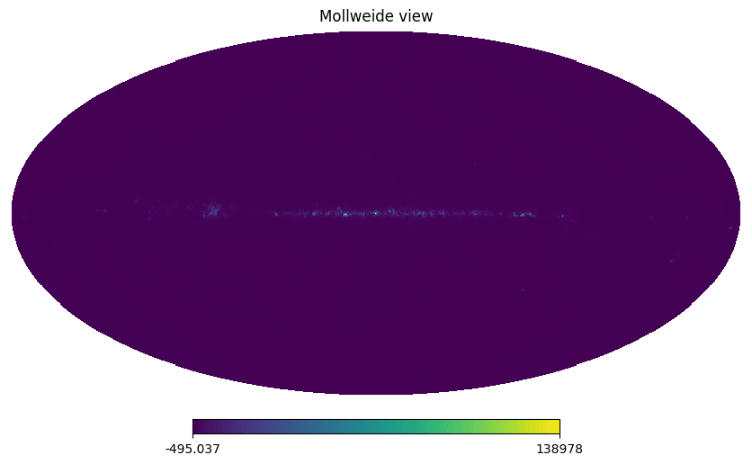

.. _Mbs:

Synthetic sky maps
==================

The LiteBIRD Simulation Framework provides the tools necessary to
produce synthetic maps of the sky. These maps are useful for a number
of applications:

1. The framework can synthetize realistic detector measurements and
   assemble them in Time Ordered Data (TOD).
2. One can run map-based simulations without the need to generate
   timelines: although less accurate than a full end-to-end
   simulation, this approach has the advantage of being much faster
   and requiring less resources.

The LiteBIRD Simulation Framework uses the PySM3 library to generate
these sky maps; it is advisable that you keep the PySM3 manual at hand
when you use the modules described in this chapter.

Here is an example showing how to use the facilities provided by the
framework to generate a CMB map::

    import litebird_sim as lbs

    sim = lbs.Simulation(base_path="../output", random_seed=12345)
    params = lbs.MbsParameters(
        make_cmb=True,
        fg_models=["pysm_synch_0", "pysm_freefree_1"],
    )
    mbs = lbs.Mbs(
        simulation=sim,
        parameters=params,
        channel_list=[
            lbs.FreqChannelInfo.from_imo(
                sim.imo,
                "/releases/v1.3/satellite/LFT/L1-040/channel_info",
            ),
        ],
    )
    (healpix_maps, file_paths) = mbs.run_all()

    import healpy
    healpy.mollview(healpix_maps["L1-040"][0])

In the dictionary containing the maps Mbs returns also two useful variables:

- The coordinates of the generated maps, in the key `Coordinates`
- The parameters used for the syntetic map generation, in the key `Mbs_parameters` 

If ``store_alms`` in :class:`.MbsParameters` is True, ``run_all`` returns alms
instead of pixel space maps. The user can set the maximum multipole of these alms with
``lmax_alms``, the default value is :math:`4\times N_{side}`. If ``gaussian_smooth`` is 
False, umbeamed maps or alms are returned.

Available emission models
-------------------------

The list of foreground models currently available for the
``fg_models`` parameter of the :class:`.MbsParameters` class is the
following:

- Anomalous emission:
  
  - ``pysm_ame_1``
    
- Dust:
  
  - ``pysm_dust_0``
    
  - ``pysm_dust_1``
    
  - ``pysm_dust_4``
    
  - ``pysm_dust_5``
    
  - ``pysm_dust_7``
    
  - ``pysm_dust_8``

- Free-free:
  
  - ``pysm_freefree_1``

- Synchrotron:
  
  - ``pysm_synch_0``
    
  - ``pysm_synch_1``

Monte Carlo simulations
-----------------------

To be written!
    

API reference
-------------

.. automodule:: litebird_sim.mbs.mbs
    :members:
    :undoc-members:
    :show-inheritance:
