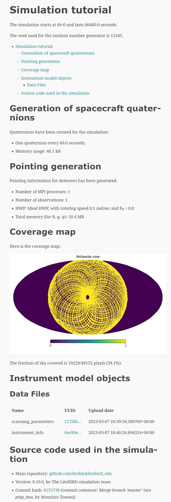

.. _tutorial:

Tutorial
========

This section contains a short tutorial that describes how to get ready
to use the framework. It assumes that you have already installed the
``litebird_sim`` framework; refer to :ref:`installation_procedure`.
For a nice and exhaustive example on how to use the framework in the 
LiteBIRD case see the `example notebook <https://github.com/litebird
/litebird_sim/blob/master/notebooks/litebird_sim_example.ipynb>`_.

A «Hello world» example
-----------------------

In this section we assume that you are running these command
interactively, either using the REPL (``python`` or IPython are both
fine) or a Jupyter notebook.

The first thing to do is to create a folder where you will write your
script. The LiteBIRD Simulation Framework is a *library*, and thus it
should be listed as one of the dependencies of your project. It's
better to use virtual environments, so that dependencies are properly
tracked:

.. code-block:: sh

  python -m virtualenv ./lbs_tutorial_venv
  source lbs_tutorial_venv/bin/activate

The last line of code might vary, depending on the Operating System
and the shell you are using; refer to the `Python documentation
<https://docs.python.org/3/tutorial/venv.html>`_ for more information.

Once you have activated the virtual environment, you should install
the LiteBIRD Simulation Framework. As it is `registered on PyPI
<https://pypi.org/project/litebird-sim/>`_, it's just a matter of
calling ``pip``:

.. code-block:: sh

  pip install litebird_sim

To ensure reproducibility of your results, it is good to keep track of
the version numbers used by your program. If you are developing with uv
(recommended for LiteBIRD Simulation Framework development), uv automatically
creates a ``uv.lock`` file that pins exact versions:

.. code-block:: sh

  # With uv (recommended for development)
  uv sync  # This creates/updates uv.lock automatically

Alternatively, if using pip, you can create a ``requirements.txt`` file:

.. code-block:: sh

  pip freeze > requirements.txt

(If you use a Version Control System like ``git``, it is a good idea
to add ``uv.lock`` or ``requirements.txt`` to the repository.) Others will then be
able to install the same versions by using ``uv sync`` or ``pip install -r requirements.txt``.

If you got no errors, you are ready to write your first program! To
follow an ancient tradition, we will write a «Hello world!» program.
Create a new file called ``my_script.py`` in the folder you just
created, and write the following::

  # File my_script.py
  import litebird_sim as lbs

  print("Starting the program...")
  sim = lbs.Simulation(base_path="./tut01", random_seed=12345)
  sim.append_to_report("Hello, world!")
  sim.flush()
  print("Done!")

Surprisingly, the program did not output ``Hello world`` as you might
have expected! Instead, it created a folder, named ``tut01``, and
wrote a few files in it:

.. code-block:: sh

  $ ls ./tut01
  report.html    report.md    sakura.css
  $

Open the file ``report.html`` using your browser (e.g., ``firefox
tut01/report.html``), and the following page will appear:

.. image:: images/tutorial-bare-report.png
   :width: 512
   :align: center
   :alt: Screenshot of part of the tutorial produced by our script

Among the many lines of text produced by the report, you can spot the
presence of our «Hello, world!» message. Hurrah!

Let's have a look at what happened. The first line imports the
``litebird_sim`` framework; since the name is quite long, it's
customary to shorten it to ``lbs``::

  import litebird_sim as lbs

The next interesting stuff happens when we instantiate a
:class:`.Simulation` object::

  sim = lbs.Simulation(base_path="./tut01", random_seed=12345,)

Creating a :class:`.Simulation` object makes a lot of complicated
things happen behind the scenes. For example, the mandatory parameter
``random_seed`` is used to build a hierarchy of random number generators useful for
generating noise. In this short example, the important things are
the following:

1. The code checks if a directory named ``tut01`` exists; if not, it
   is created.
2. An empty report is created.

The report is where the results of a simulation will be saved, and
sections can be appended to it using the method
:meth:`.Simulation.append_to_report`, like we did in our example::

  sim.append_to_report("Hello, world!")

The report is actually written to disk only when
:meth:`.Simulation.flush` is called::

  sim.flush()

This is the most basic usage of the :class:`.Simulation` class; for
more information, refer to :ref:`simulations`.

In the next section, we will make something more interesting using the
framework.

Interacting with the IMO
------------------------

It's not clear why we should want to install a whole framework just to
create a HTML file, no matter how nice it looks. Things begin to get
interesting once we start using other facilities provided by our
framework.

Simulations for real-life experiments often require to use several
parameters that describe the instruments being simulated: how many
detectors there are, what are their properties, etc. These information
are usually kept in an Instrument MOdel database, IMO for short.

The LiteBIRD IMO is managed using `InstrumentDB
<https://github.com/ziotom78/instrumentdb>`_, a web-based database,
but it can be retrieved also as a bundle of files. The LiteBIRD
simulation framework seamlessy interacts with the IMO database and
permits to retrieve all the parameters that describe the LiteBIRD
instruments.

The simulation framework contains a IMO containing a small
representation of the instruments as described in the paper
`*Probing cosmic inflation with the LiteBIRD cosmic microwave background
polarization survey* <https://academic.oup.com/ptep/article/2023/4/042F01/6835420>`_
(PTEP, 2022). We will use this small IMO in the tutorial; if you
want to do some serious work, you should install your own copy
of the “full” official IMO. Refer to :ref:`imo-configuration` for
more information.

Our next example will use the IMO to run something more interesting:

.. testcode::

  import litebird_sim as lbs

  imo = lbs.Imo(flatfile_location=lbs.PTEP_IMO_LOCATION)

  sim = lbs.Simulation(base_path="./tut02", random_seed=12345)
  lft_file = sim.imo.query(
      "/releases/vPTEP/satellite/LFT/instrument_info"
  )
  sim.append_to_report(
      "The instrument {{ name }} has {{ num }} channels.",
      name=lft_file.metadata["name"],
      num=lft_file.metadata['number_of_channels'],
  )

  html_report_path = sim.flush()
  print(f"Done, the report has been saved in file {html_report_path.name}")

.. testoutput::

  Done, the report has been saved in file report.html

Let's dig into the code of the example. The first line looks almost
the same as in the previous example::

  # Previous example
  sim = lbs.Simulation(base_path="./tut01", random_seed=12345)

  # This example
  sim = lbs.Simulation(base_path="./tut02", random_seed=12345)

Yet a big difference went unnoticed: since you configured the IMO
using the ``install_imo`` module, the :class:`.Simulation` class
managed to read the database contents and initialize a set of member
variables. This is why we have been able to write the next line::

  lft_file = sim.imo.query(
      "/releases/vPTEP/satellite/LFT/instrument_info"
  )

Although the parameter looks like a path to some file, it is a
reference to a bit of information in the IMO; specifically, a set of
parameters characterizing the instrument LFT (Low Frequency
Telescope). This call retrieves the parameters and returns a
:class:`.DataFile` object, which contains the information in its
``metadata`` field. These are used to fill the report::

  sim.append_to_report(
      "The instrument {{ name }} has {{ num }} channels.",
      name=lft_file.metadata["name"],
      num=lft_file.metadata['number_of_channels'],
  )

The code should be self-evident: the keywords ``name`` and ``num`` are
used in the text to put some actual values within the placeholders
``{{ … }}``. This is the syntax used by `Jinja2
<https://jinja.palletsprojects.com/en/2.11.x/>`_, a powerful
templating library.

The last lines write the report to disk and return the path to the
HTML file::

  html_report_path = sim.flush()
  print(f"Done, the report has been saved in file {html_report_path.name}")

This example showed you how to retrieve information from the IMO and
introduced some features of the method
:meth:`.Simulation.append_to_report`. To learn a bit more about the
the IMO, read :ref:`imo`; for reporting facilities, read
:ref:`reporting`.

Creating a coverage map
-----------------------

We're now moving to something more «astrophysical»: we will write a
program that computes the sky coverage of a scanning
strategy over some time.

The code is complex because it uses several concepts explained in the
section :ref:`scanning-strategy`; in fact, this example is very
similar to the one shown in that section. It's not needed that you
understand everything, just have a look at the code that generates the
report::

  import litebird_sim as lbs
  import healpy, numpy as np
  import matplotlib.pylab as plt
  import astropy.units as u

  imo = lbs.Imo(flatfile_location=lbs.PTEP_IMO_LOCATION)

  sim = lbs.Simulation(
      base_path="./tut04",
      name="Simulation tutorial",
      start_time=0,
      duration_s=86400.,
      random_seed=12345,
      imo=imo,
  )

  sim.set_scanning_strategy(
      scanning_strategy=lbs.SpinningScanningStrategy.from_imo(
          imo=imo,
          url="/releases/vPTEP/satellite/scanning_parameters",
      ),
  )

  sim.set_instrument(
      lbs.InstrumentInfo.from_imo(
          imo=imo,
          url="/releases/vPTEP/satellite/LFT/instrument_info",
      ),
  )

  sim.set_hwp(lbs.IdealHWP(ang_speed_radpsec=0.1))

  # It is entirely possible to mix up definitions taken from
  # the IMO with hand-made objects. In this example, we create
  # a mock detector instead of reading one from the PTEP IMO.
  sim.create_observations(
      detectors=lbs.DetectorInfo(name="foo", sampling_rate_hz=10),
  )

  sim.prepare_pointings()

  for cur_obs in sim.observations:
      # We use `_` to ignore the HWP angle
      cur_pointings, _ = cur_obs.get_pointings(0)
      nside = 64
      pixidx = healpy.ang2pix(
          nside,
          cur_pointings[:, 0],
          cur_pointings[:, 1],
      )
      m = np.zeros(healpy.nside2npix(nside))
      m[pixidx] = 1
      healpy.mollview(m)

  sim.append_to_report("""

  ## Coverage map

  Here is the coverage map:

  

  The fraction of sky covered is {{ seen }}/{{ total }} pixels
  ({{ "%.1f" | format(percentage) }}%).
  """,
      figures=[(plt.gcf(), "coverage_map.png")],
      seen=len(m[m > 0]),
      total=len(m),
      percentage=100.0 * len(m[m > 0]) / len(m),
  )

  sim.flush()

This example is interesting because it shows how to interface Healpy
with the report-generation facilities provided by our framework. As
explained in :ref:`scanning-strategy`, the code above does the
following things:

1. It sets the scanning strategy, triggering the computation of set
   of quaternions that encode the orientation of
   the spacecraft for the whole duration of the simulation (86,400
   seconds, that is one day);
2. It creates an instance of the class :class:`.InstrumentInfo` and
   it registers them using the method
   :meth:`.Simulation.set_instrument`;
3. It instantiates a new class that represents an ideal Half-wave Plate
   (HWP);
4. It sets the detectors to be simulated and allocates the TODs through
   the call to :meth:`.Simulation.create_observations`;
5. It computes the quaternions needed to compute the actual pointings
   through the call to :meth:`.Simulation.prepare_pointings`;
6. It produces a coverage map by setting to 1 all those pixels that
   are visited by the directions encoded in the pointing information
   matrix. To do this, it iterates over all the instances of the
   class :class:`.Observation` in the
   :class:`.Simulation` object. (In this simple example, there is only
   one :class:`.Observation`, but in more complex examples there can
   be many of them.) For each :class:`.Observation`, it uses the
   method :meth:`.Observation.get_pointings` to compute the pointing
   information for that observation.
7. The objects that were read from IMO are properly listed in the
   report.

If you run the example, you will see that the folder ``tut04`` will be
populated with the following files:

.. code-block:: sh

  $ ls tut04
  coverage_map.png  report.html  report.md  sakura.css
  $

A new file has appeared: ``coverage_map.png``. If you open the file
``report.html``, you will see that the map has been included in the
report:

Creating a signal plus noise timeline 
-------------------------------------

Here we generate a 10 minutes timeline which contains dipole, cmb signal,
galactic dust, and correlated noise. For the noise, we use the random
number generator provided by the :class:`.Simulation` and seeded with
``random_seed``::

  import litebird_sim as lbs
  import healpy, numpy as np
  import matplotlib.pylab as plt
  from astropy import units, time

  sim = lbs.Simulation(
      base_path="./tut05",
      name="Simulation tutorial",
      start_time=time.Time("2025-01-01T00:00:00"),
      duration_s=10 * units.minute.to("s"),
      random_seed=12345,
  )

  sim.set_scanning_strategy(
      scanning_strategy=lbs.SpinningScanningStrategy(
          spin_sun_angle_rad=np.deg2rad(30), # CORE-specific parameter
          spin_rate_hz=0.5 / 60,     # Ditto
          precession_rate_hz=1.0 / (4 * units.day).to("s").value,
      )
  )

  sim.set_instrument(
      lbs.InstrumentInfo(
          name="core",
          spin_boresight_angle_rad=np.deg2rad(65),
      ),
  )

  sim.set_hwp(lbs.IdealHWP(ang_speed_radpsec=0.1))

  detector = lbs.DetectorInfo(
      name="foo", 
      sampling_rate_hz=10.0, 
      bandcenter_ghz = 200.0,
      net_ukrts = 50.0,
      fknee_mhz = 20.0,
      fmin_hz = 1e-05,
      alpha=1.0,
  )

  sky_params = lbs.SkyGenerationParams(
      nside=128,
      make_cmb=True,
      make_fg=True,
      fg_models=["d0"],
  )

  sky_gen = lbs.SkyGenerator(
      parameters=sky_params,
      detectors=detector,
  )
  maps = sky_gen.execute()

  sim.create_observations(
      detectors=detector,
  )

  sim.prepare_pointings()

  sim.add_dipole()

  sim.add_noise()

  sim.fill_tods(maps=maps)

  times = sim.observations[0].get_times() - sim.observations[0].start_time.cxcsec

  plt.plot(times,sim.observations[0].tod[0,:])
  plt.xlabel("Time [s]")
  plt.ylabel("Signal [K]")

  sim.append_to_report("""

  ## Timeline

  Here 10 minutes timeline:

  

  """,
  figures=[(plt.gcf(), "timeline.png")],
  )

  sim.flush()

Creating a signal plus noise timeline 
-------------------------------------

Here we generate a 1 year timeline which contains cmb signal, galactic
dust, and white noise. The we bin the timeline in a map. ::

  import litebird_sim as lbs
  import numpy as np
  import matplotlib.pylab as plt
  import healpy as hp
  from astropy import units, time

  sim = lbs.Simulation(
      base_path="./tut06",
      name="Simulation tutorial",
      start_time=0,
      duration_s=1 * units.year.to("s"),
      random_seed=12345,
  )

  nside = 64

  sim.set_scanning_strategy(
      scanning_strategy=lbs.SpinningScanningStrategy(
          spin_sun_angle_rad=np.deg2rad(30), # CORE-specific parameter
          spin_rate_hz=0.5 / 60,     # Ditto
          precession_rate_hz=1.0 / (4 * units.day).to("s").value,
      )
  )

  sim.set_instrument(
      lbs.InstrumentInfo(
          name="core",
          spin_boresight_angle_rad=np.deg2rad(65),
      ),
  )

  sim.set_hwp(lbs.IdealHWP(ang_speed_radpsec=0.1))

  detector = lbs.DetectorInfo(
      name="foo", 
      sampling_rate_hz=3.0, 
      bandcenter_ghz = 150.0,
      net_ukrts = 50.0,
  )

  sky_params = lbs.SkyGenerationParams(
      nside=nside,
      make_cmb=True,
      make_fg=True,
      fg_models=["d0"],
  )

  sky_gen = lbs.SkyGenerator(
      parameters=sky_params,
      detectors=detector,
  )
  maps = sky_gen.execute()

  sim.create_observations(
      detectors=detector,
  )

  sim.prepare_pointings()

  sim.fill_tods(maps)

  sim.add_noise(noise_type="white")

  binner_results = sim.make_binned_map(nside=nside)
  binned = binner_results.binned_map

  plt.figure(figsize=(15, 3.2))
  hp.mollview(binned[0], sub=131, title="T", unit=r"[K]")
  hp.mollview(binned[1], sub=132, title="Q", unit=r"[K]")
  hp.mollview(binned[2], sub=133, title="U", unit=r"[K]")

  sim.append_to_report("""

  ## Maps

  Here 1 year maps:

  

  """,
  figures=[(plt.gcf(), "maps.png")],
  )

  sim.flush()

The elements shown in these tutorials should allow you to generate more
complex scripts. The next sections detail the features of the framework
in greater detail.